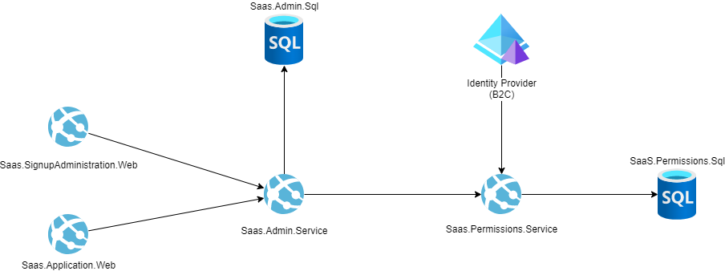

# Azure SaaS Development Kit (ASDK)

## Project Overview

The Azure SaaS Development Kit (ASDK) provides a starting point into cloud-based Software as a Service (SaaS) for developers, startups, ISVs and enterprises. A platform for platform creators. The ASDK provides a reference architecture that is extensible to meet your application's needs, microservice-oriented, and fully-documented to empower all levels of experience in their entry into Azure Cloud Services.

For more information please review the [ASDK Documentation](https://azure.github.io/azure-saas/), including a Quick Start guide for environment setup.

## Contents

### Modules

Several individual module readmes have been provided to cover key development concepts, necessary app setting secrets and how to run them locally.

- [Admin Service](src/Saas.Admin) - Primary services administrating Tenant info and providing relevant information to frontend applications
- [Permissions Service](src\Saas.Identity\Saas.Permissions) - Services utilized by the Admin services to determine action authorization
- [Signup Application Web](src\Saas.SignupAdministration) - MVC web application for new Tenant signup
- [SaaS Application Web](src\Saas.Application) - Razor application providing the SaaS service to registered tenants

### GitHub Workflows

Yaml files [have been included](.github\workflows) that define [GitHub workflow actions](https://docs.github.com/en/actions/using-workflows/about-workflows), including scripts which publish container images of your modules to the [GitHub Container Registry](https://docs.github.com/en/packages/working-with-a-github-packages-registry/working-with-the-container-registry). Read the corresponding [documentation](https://azure.github.io/azure-saas/resources/container-publishing/) for more information.

## Contributing

This project welcomes contributions and suggestions. Most contributions require you to agree to a Contributor License Agreement (CLA) declaring that you have the right to, and actually do, grant us the rights to use your contribution. For details, visit
https://cla.microsoft.com.

When you submit a pull request, a CLA-bot will automatically determine whether you need to provide a CLA and decorate the PR appropriately (e.g., label, comment). Simply follow the instructions provided by the bot. You will only need to do this once across all repositories using our CLA.

This project has adopted the [Microsoft Open Source Code of Conduct](https://opensource.microsoft.com/codeofconduct/). For more information see the [Code of Conduct FAQ](https://opensource.microsoft.com/codeofconduct/faq/) or contact [opencode@microsoft.com](mailto:opencode@microsoft.com) with any additional questions or comments.

## License
The Azure SaaS Development Kit is licensed under the MIT license. See the LICENSE file for more details.