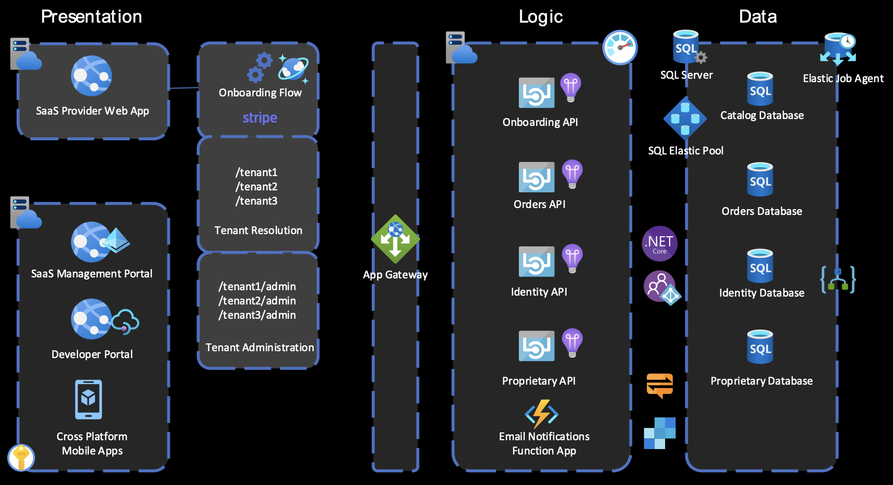
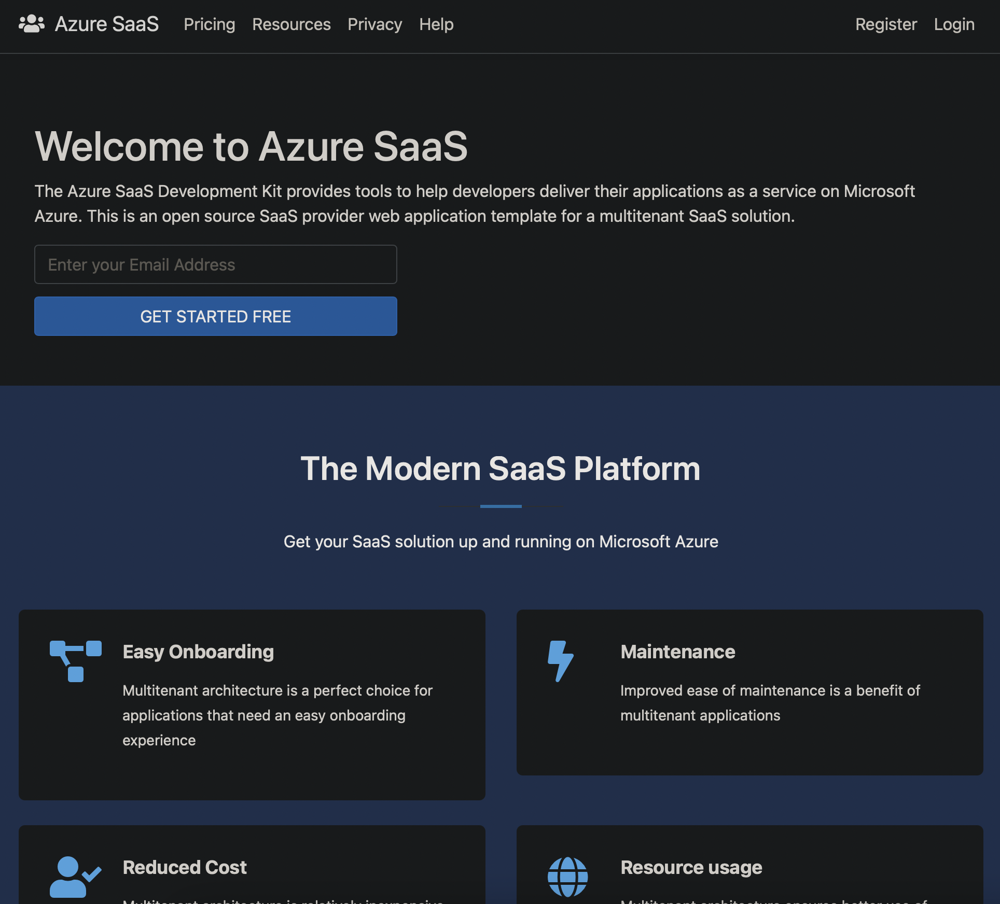
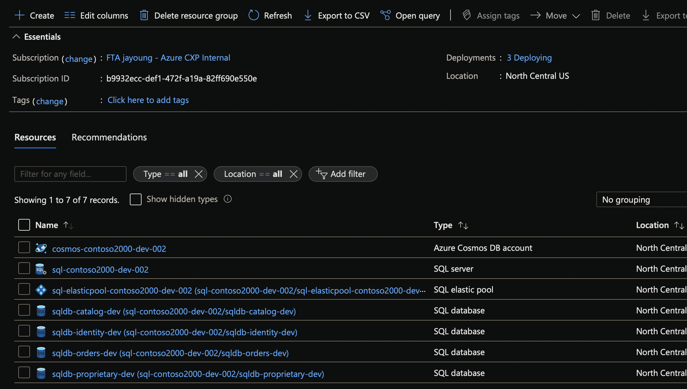

# Azure SaaS Development Kit

Making cloud-based SaaS applications easy.

## Included in this kit
1. A basic reference architecture diagram
1. A sample production application demonstrating modern SaaS features
1. A lightweight Azure template/scaffolding that you can deploy in minutes
1. Links to documentation with tips, tricks, and best practices

## Reference Architecture

## Sample Applications

[OnSubscriber](https://www.onsubscriber.com) is a **real**, **production application** built on top of the SaaS Development Kit.

[Azure SaaS](https://azuresaas.net) is a sample application demonstrating the full capabilities available in this kit.

## Azure Template/Scaffolding

Deploy an instance of the template in less than 5 minutes!

Once the deployment completes, you'll have the resources deployed in your Azure subscription. Please be aware that while the costs are low, you are responsible for any chargees.

To get started in your own development environment, follow our [getting started guide](docs/getting-started.md).

## Additional Help

* [Multi-tenant SaaS database tenancy patterns](https://docs.microsoft.com/en-us/azure/azure-sql/database/saas-tenancy-app-design-patterns)

## License
The Azure SaaS Development Kit is licensed under the MIT license. See the [LICENSE file](LICENSE) for more details.