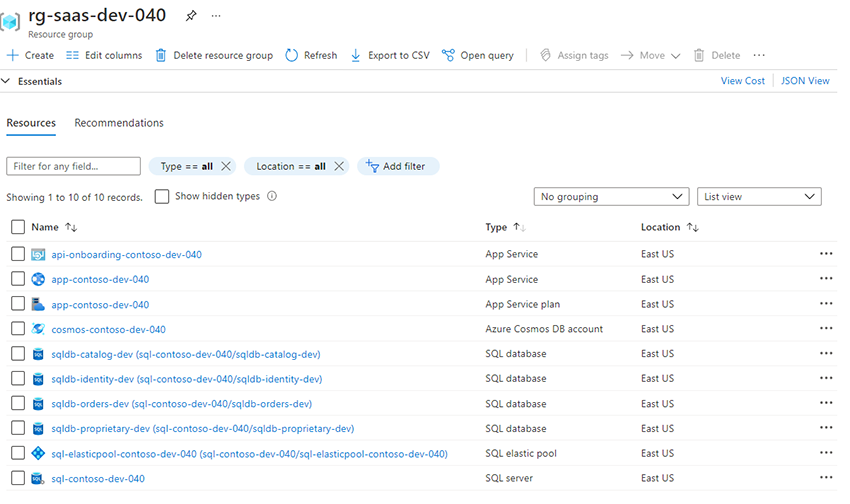

# Azure SaaS Development Kit (ASDK)

The Azure SaaS Development Kit (ASDK) provides a reference architecture, reference implementation and tools to help developers, startups, ISVs and Enterprises deliver their applications as a SaaS service.  A platform for platform creators.

## Included in the Kit
1. A multitenant reference architecture
1. A sample reference implemenation that can be deployed in minutes
1. Documentation with tips, tricks, and best practices related to onboarding new tenants, elasticity, operational architecture, billing, identity, security, monitoring and more
1. Links to production SaaS platforms built using the Azure SaaS Development Kit

<!-- https://www.azuresaas.net -->

## Reference Architecture

## Reference Implementation
The reference implementation provides an end-to-end SaaS service including all required microservices and their corresponding data stores to power your SaaS service.  Simply [deploy](https://portal.azure.com/#create/Microsoft.Template/uri/https%3A%2F%2Fraw.githubusercontent.com%2FAzure%2Fazure-saas%2Fmain%2Fsrc%2FSaas.Deployment%2FSaas.Deployment.Root%2Fazuredeploy.json) to your Azure subscription, clone the repo and migrate your business logic.

<!-- Demo SaaS Service:  https://www.azuresaas.net -->

## Deployment
[Deploy](https://portal.azure.com/#create/Microsoft.Template/uri/https%3A%2F%2Fraw.githubusercontent.com%2FAzure%2Fazure-saas%2Fmain%2Fsrc%2FSaas.Deployment%2FSaas.Deployment.Root%2Fazuredeploy.json) an instance of the reference implemenation in less than 5 minutes.  Once the deployment completes, you'll have all the resources deployed in your Azure subscription. Please be aware that while the costs are low, you are responsible for any charges incurred.  Deploy the full service or deploy [microservices / componenents](docs/components.md) indivually.

## Solution Roadmap
- Azure Kubernetes Services (AKS) for tenant containerization
- Azure Container Registry (ACR)
- Azure Bicep for Azure resource deployments
- .NET MAUI Cross Platform Mobile Apps - Multitenant

## Production SaaS Services
Subscriber from ISV Modern Appz is a live production SaaS solution built entirely on the Azure SaaS Development Kit:
https://www.onsubscriber.com

## Subscribe for Updates
Subscribe for email notifications of updates and new features:  
https://www.onsubscriber.com/azuresaas

## Downloads
https://www.azuresaas.net/resources
- How to Build a SaaS Service on Azure (Webinar Slide Deck)  
- Multitenant SaaS Micrososervice Architecture Diagram

## License
The Azure SaaS Development Kit is licensed under the MIT license. See the LICENSE file for more details.