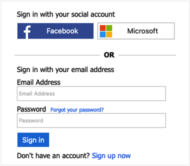
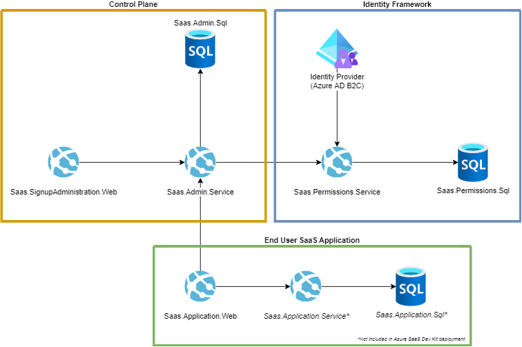

# Azure SaaS Development Kit (ASDK)

## TL;DR

The Azure SaaS Development Kit (ASDK) provide a cloud native starting point build with security, resilience and reliability in mind. Accelerate your SaaS journey with the Azure SaaS Development Kit.

### Get started 1-2-3

1. Git fork this repo, making it your own.
2. Follow the [Quick Start](https://azure.github.io/azure-saas/quick-start/) to see ASDK in motion.
3. Start building and learning, guided by the code and documentation provided.

If you run into any challenges or have questions, please open an issue on this repo.

## Overview

The [Azure SaaS Development Kit (ASDK)](https://azure.microsoft.com/en-us/resources/development-kit/saas/) is a solid starting point for building [cloud-native](https://learn.microsoft.com/en-us/dotnet/architecture/cloud-native/definition) Software as a Service (SaaS) solutions, offering a reference architecture based on best practices and design patterns as outlined in the Azure Architecture Center: [Architecting multitenant solutions on Azure - Azure Architecture Center | Microsoft Learn](https://learn.microsoft.com/en-us/azure/architecture/guide/multitenant/overview)

The ASDK has been created specifically for developers and architects building platforms and solutions for start-ups, ISVs, and enterprises. It can be used as a starting point if you are a start-up, as well as a reference architecture if you are migrating or refactoring an existing solution.

The main focus of the ASDK is on the creation of a solid [Control Plane](https://learn.microsoft.com/en-us/azure/architecture/guide/multitenant/considerations/control-planes) for your SaaS solution. A Control Plane is crucial for a SaaS architecture because it manages and orchestrates the infrastructure, services, and resources, enabling seamless scaling, monitoring, and automation of the underlying components, which ultimately helps to ensure optimal performance and reliability of the SaaS application. The ASDK provides essential capabilities in the areas of:

- Identity - [including sign-in with an existing identity such as a social account](https://learn.microsoft.com/en-us/azure/active-directory-b2c/add-sign-up-and-sign-in-policy?pivots=b2c-custom-policy).
- Permissions
- Tenant management
- User Management
- Onboarding
- Observability
- Configuration management
- Scalability
- CI/CD
- ...and more

For more information, including the [Quick Start](https://azure.github.io/azure-saas/quick-start/) guide for deploying a running version of the ASDK, please refer to the [ASDK Documentation](https://azure.github.io/azure-saas/).

## Modules

- [Identity Foundation Services](./src/Saas.Identity/Saas.IdentityProvider) - The core deployment and configuration of the infrastructure and services for the ASDK.
- [Admin Service](src/Saas.Admin) - Primary services administrating Tenant info and providing relevant information to frontend applications
- [Permissions Service](src/Saas.Identity/Saas.Permissions) - Service utilized by the Admin services to determine authorization by providing permissions claims to the identity provider.
- [Signup Application Web](src/Saas.SignupAdministration) - MVC web application for new Tenant signup
- [SaaS Application Web](src/Saas.Application) - Razor application providing the SaaS service to registered tenants

For each of the modules, documentation and deployment details are provided. 

# Want to contribute?

This project welcomes contributions and suggestions. Most contributions require you to agree to a Contributor License Agreement (CLA) declaring that you have the right to, and actually do, grant us the rights to use your contribution. For details, visit
https://cla.microsoft.com.

When you submit a pull request, a CLA-bot will automatically determine whether you need to provide a CLA and decorate the PR appropriately (e.g., label, comment). Simply follow the instructions provided by the bot. You will only need to do this once across all repositories using our CLA.

This project has adopted the [Microsoft Open Source Code of Conduct](https://opensource.microsoft.com/codeofconduct/). For more information see the [Code of Conduct FAQ](https://opensource.microsoft.com/codeofconduct/faq/) or contact [opencode@microsoft.com](mailto:opencode@microsoft.com) with any additional questions or comments.

# License
The Azure SaaS Development Kit is licensed under the MIT license. See the LICENSE file for more details.
