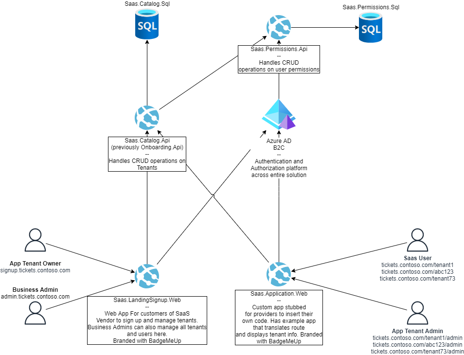

# Welcome to the Azure SaaS Dev Kit

[Software as a Service (SaaS)](https://azure.microsoft.com/en-us/overview/what-is-saas/) doesn’t need to be complex and time consuming.

The Azure SaaS Development Kit is a reference implementation of pre-built modular resources to help you launch your SaaS offering faster:

* Standard SaaS components deployable individually or mix-and-match
* [Open-source code](https://github.com/Azure/azure-saas), allowing engineers to build by example or modify/extend to be purpose-built
* Fully documented code allows for self-serve usage

Whether you're modernizing an existing application, building a new application, or migrating your application, the SaaS dev kit can help you.

## Modules & Architecture

- [**Identity Provider (B2C)**](components/identity/identity-provider/) - Provides a flexible identity solution.
- [**Signup / Administration**](components/signup-administration/)
	- A web app where your customers to view plans and onboard to your solution.
	- Provides you with tenant administration capabilities. (modify/remove/etc.)
- [**SaaS.Application**](components/saas-application/) - A sample application that you can extend or replace with your own code.

## Product SaaS Reference

[OnSubscriber](https://www.onsubscriber.com/) is a live production SaaS solution built entirely on the Azure SaaS Development Kit.

It's a real production site that allows users to easily build their Email and SMS lists using social login with Facebook, Google, Apple, Email and SMS. In addition, users can add profile pictures, bios, external links and social accounts to their tenants.

## Ready to get started?

Check out the [quick start page](quick-start/).

## Additional Recommended Resources

* [Best practices for architecting multi-tenant solutions](https://aka.ms/multitenancy)
* [ISV Considerations for Azure landing zones](https://aka.ms/isv-landing-zones)
* [Azure Well-Architected Framework](https://docs.microsoft.com/en-us/azure/architecture/framework/)
* [WingTips Tickets SaaS Application](https://docs.microsoft.com/en-us/azure/azure-sql/database/saas-tenancy-welcome-wingtip-tickets-app) - Provides details into tradeoffs with various tenancy models within the database layer.

## Next Steps