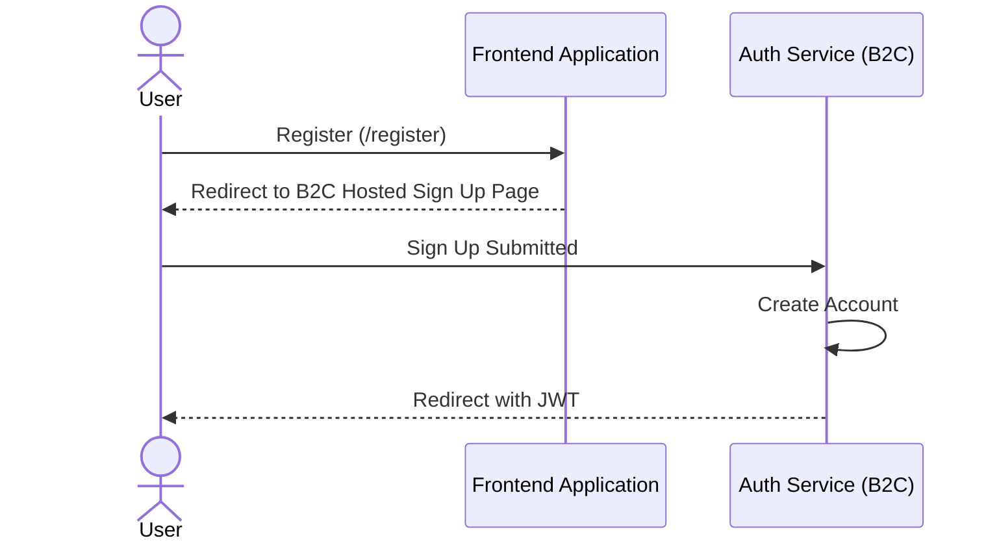
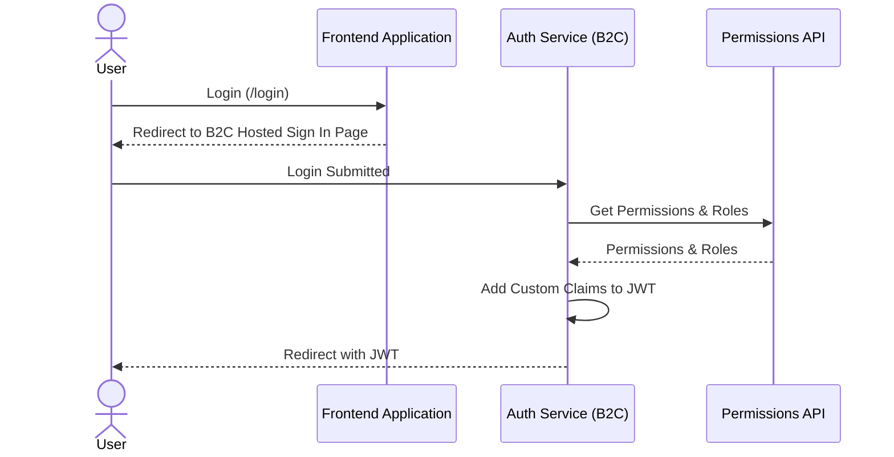
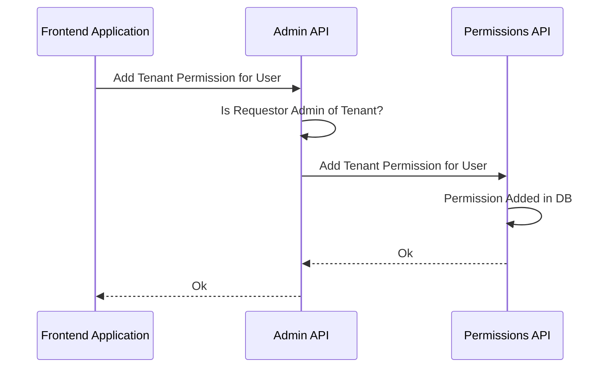

## Sign Up

```mermaid
sequenceDiagram  
actor user as User 
participant frontend as Frontend Application
participant auth as Auth Service (B2C)


user->>frontend : Register (/register)
frontend-->>user : Redirect to B2C Hosted Sign Up Page
user->>auth : Sign Up Submitted
auth->>auth : Create Account
auth-->>user : Redirect with JWT
```

## Sign In

```mermaid
sequenceDiagram  
actor user as User
participant frontend as Frontend Application
participant auth as Auth Service (B2C)
participant perm as Permissions API


user->>frontend : Login (/login)
frontend-->>user : Redirect to B2C Hosted Sign In Page
user->>auth : Login Submitted
auth->>perm : Get Permissions & Roles
perm-->>auth : Permissions & Roles
auth->>auth : Add Custom Claims to JWT
auth-->>user : Redirect with JWT
```

## Add Permissions Record (Generic)

```mermaid
sequenceDiagram
participant frontend as Frontend Application
participant admin as Admin API
participant perm as Permissions API

frontend->>admin : Add Tenant Permission for User
admin->>admin : Is Requestor Admin of Tenant?
admin->>perm : Add Tenant Permission for User
perm->>perm : Permission Added in DB
perm-->>admin : Ok
admin-->>frontend : Ok

```
