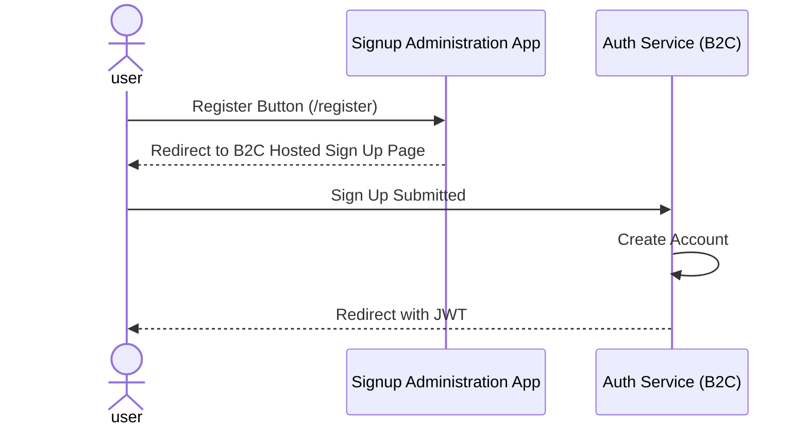
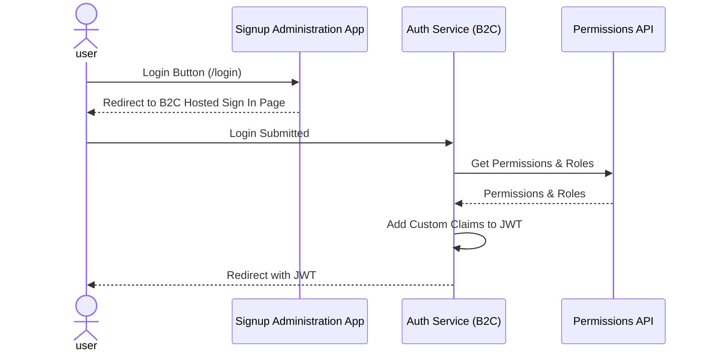

## Sign Up

```mermaid
sequenceDiagram  
actor user 
participant signup as Signup Administration App
participant auth as Auth Service (B2C)


user->>signup : Register Button (/register)
signup-->>user : Redirect to B2C Hosted Sign Up Page
user->>auth : Sign Up Submitted
auth->>auth : Create Account
auth-->>user : Redirect with JWT
```

# Sign In

```mermaid
sequenceDiagram  
actor user 
participant signup as Signup Administration App
participant auth as Auth Service (B2C)
participant perm as Permissions API


user->>signup : Login Button (/login)
signup-->>user : Redirect to B2C Hosted Sign In Page
user->>auth : Login Submitted
auth->>perm : Get Permissions & Roles
perm-->>auth : Permissions & Roles
auth->>auth : Add Custom Claims to JWT
auth-->>user : Redirect with JWT
```
