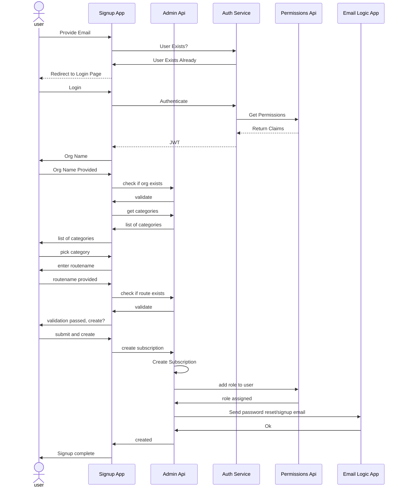
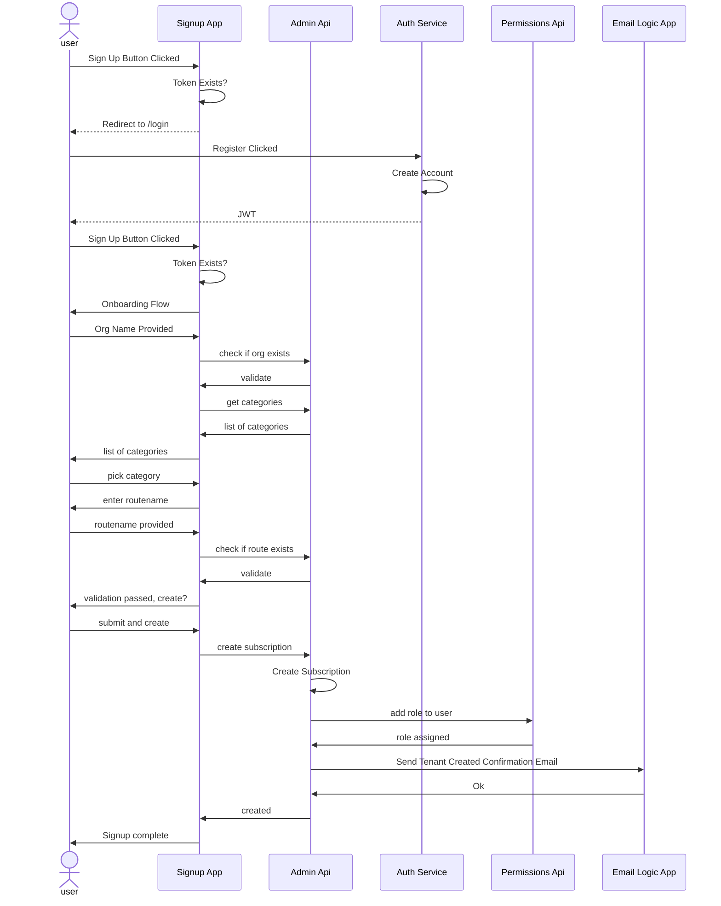

## Onboarding - Existing User

```mermaid
sequenceDiagram  
actor user 
participant signup as Signup App
participant admin as Admin Api
participant auth as Auth Service
participant perm as Permissions Api
participant email as Email Logic App

user->>signup: Provide Email
signup->>auth: User Exists?
auth->>signup: User Exists Already
signup-->>user : Redirect to Login Page
user->>signup : Login
signup->>auth : Authenticate
auth->>perm : Get Permissions
perm-->>auth : Return Claims
auth-->>signup : JWT
signup->>user: Org Name
user->>signup: Org Name Provided
signup->>admin: check if org exists
admin->>signup: validate
signup->>admin: get categories
admin->>signup: list of categories
signup->>user: list of categories
user->>signup: pick category
signup->>user: enter routename
user->>signup: routename provided
signup->>admin: check if route exists
admin->>signup: validate
signup->>user: validation passed, create?
user->>signup: submit and create

signup->>admin: create subscription
admin->>admin: Create Subscription
admin->>perm: add role to user
perm->>admin:role assigned
admin->>email : Send password reset/signup email
email->>admin: Ok
admin->>signup: created


signup->>user: Signup complete
```

## Onboarding - New User

```mermaid
sequenceDiagram  
actor user 
participant signup as Signup App
participant admin as Admin Api
participant auth as Auth Service
participant perm as Permissions Api
participant email as Email Logic App

user->>signup: Sign Up Button Clicked

signup->>signup: Token Exists?
signup-->>user: Redirect to /login
user->>auth : Register Clicked
auth->>auth : Create Account
auth-->>user : JWT
user->>signup: Sign Up Button Clicked
signup->>signup: Token Exists?
signup->>user : Onboarding Flow
%% what happens here? They dont have a password. Just an orphaned account
user->>signup: Org Name Provided
signup->>admin: check if org exists
admin->>signup: validate
signup->>admin: get categories
admin->>signup: list of categories
signup->>user: list of categories
user->>signup: pick category
signup->>user: enter routename
user->>signup: routename provided
signup->>admin: check if route exists
admin->>signup: validate
signup->>user: validation passed, create?
user->>signup: submit and create

signup->>admin: create subscription
admin->>admin: Create Subscription
admin->>perm: add role to user
perm->>admin:role assigned

admin->>email : Send Tenant Created Confirmation Email
email->>admin : Ok
admin->>signup: created


signup->>user: Signup complete
```