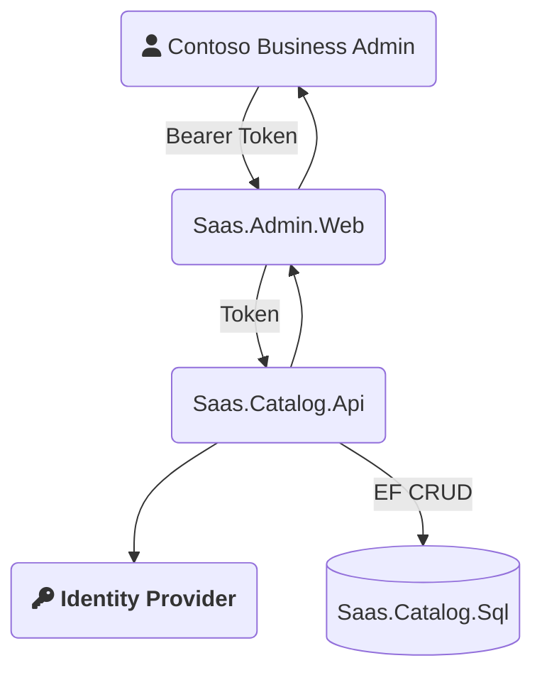

## Overview

- The identity provider default implementation is [Azure B2C](https://docs.microsoft.com/en-us/azure/active-directory-b2c/overview).
- If your scenario uses [Azure AAD](https://azure.microsoft.com/en-us/services/active-directory/), you can swap out the **Identity Provider** in the diagram below.
- B2C is offering permissions as a service.

### What does B2C Give Us?

Azure Active Directory B2C provides business-to-customer identity as a service. It enables easily authenticate users to your application using their preferred identity provider, and is configurable to support a wide array of scenarios.

### Configuration

B2C has two methods of configuring the business logic that users follow to gain access to your application: [User Flows and Custom Policies](https://docs.microsoft.com/en-us/azure/active-directory-b2c/user-flow-overview). User Flows are predefined and are configured directly through the B2C Web Portal. Custom Policies are XML based configuration that is uploaded to the B2C tenant.

The ASDK project uses Custom Policies to configure the B2C tenant. The XML configuration that gets deployed can be found under the [Saas.IdentityProvider](https://github.com/Azure/azure-saas/tree/main/src/Saas.Identity/Saas.IdentityProvider) folder within the repo, and you can read more about how to configure custom policies [here](https://docs.microsoft.com/en-us/azure/active-directory-b2c/user-flow-overview).

When deploying the B2C Identity Provider via the instructions found in the [Quick Start](../../quick-start) guide, B2C is configured to do the following:

- Provide a hosted SignIn and SignUp page that users can be directed to
- Reach out to the [SaaS.Permissions.Service](../permissions-service) upon a user signing in to fetch their application permissions and roles

You can change/extend the behavior of B2C to do things like collect more information during signup, force users to enroll in Multi-Factor Authentication (MFA), and much more by modifying the custom policies. 
## Design Considerations and FAQ

- Q: Why did we choose b2c?
  - A: We chose B2C because, in additional to authenticating with "local" accounts, it can be easily extended to support a wide array of other identity providers such as Azure AD, Github, and many more. See the [documentation](https://docs.microsoft.com/en-us/azure/active-directory-b2c/add-identity-provider) for details.

- Q: Why did we choose custom policies over user flows?
  - A: User Flows are predefined and meant for more basic use cases. Custom Policies provide more support for automating the setup and deployment of the B2C configuration, and generally provide greater extensibility in the long term for more complicated scenarios.

<!-- TODO : Update this to new architecture -->
