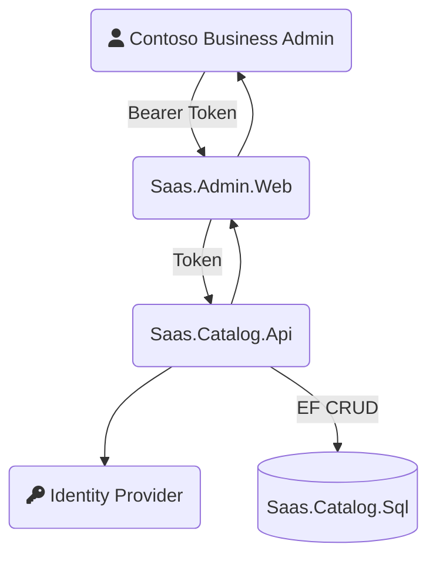

```mermaid
graph
	user("fa:fa-user Contoso Business Admin")
	adminweb("Saas.Admin.Web")
	identityapi("fa:fa-key Identity Provider")
	catalogapi("Saas.Catalog.Api")
	catalogsql[(Saas.Catalog.Sql)]

	user-- Bearer Token -->adminweb
	adminweb-->user

	adminweb-- Token -->catalogapi
	catalogapi-->adminweb

	catalogapi-->identityapi

	catalogapi-- EF CRUD -->catalogsql
```