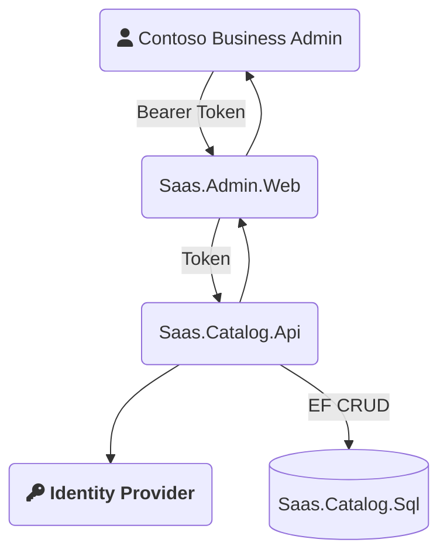

- The identity provider default implementation is [Azure B2C](https://docs.microsoft.com/en-us/azure/active-directory-b2c/overview).
- If your scenario uses [Azure AAD](https://azure.microsoft.com/en-us/services/active-directory/), you can swap out the **Identity Provider** in the diagram below.
- B2C is offering permissions as a service.

