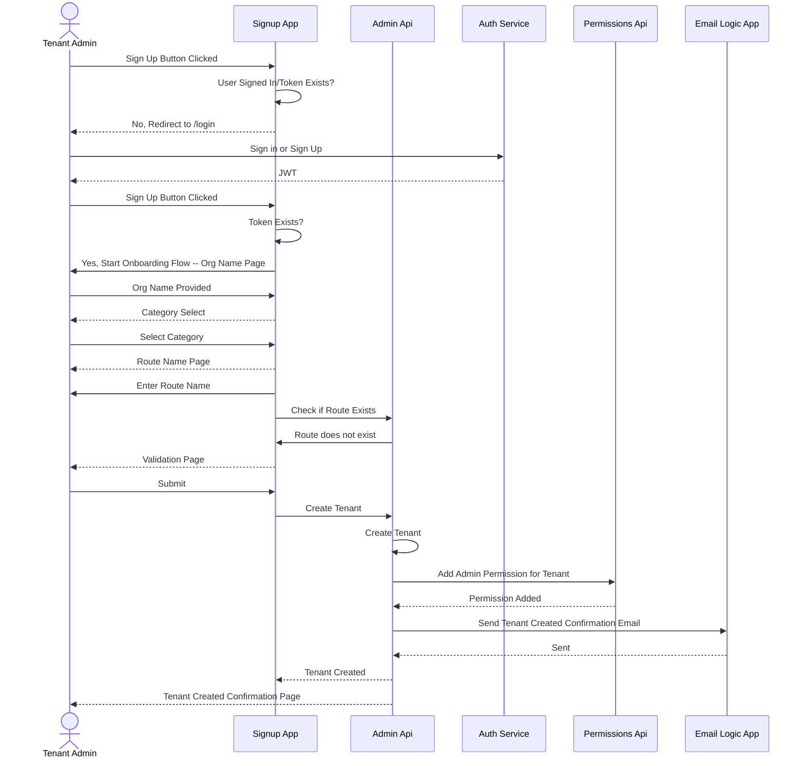
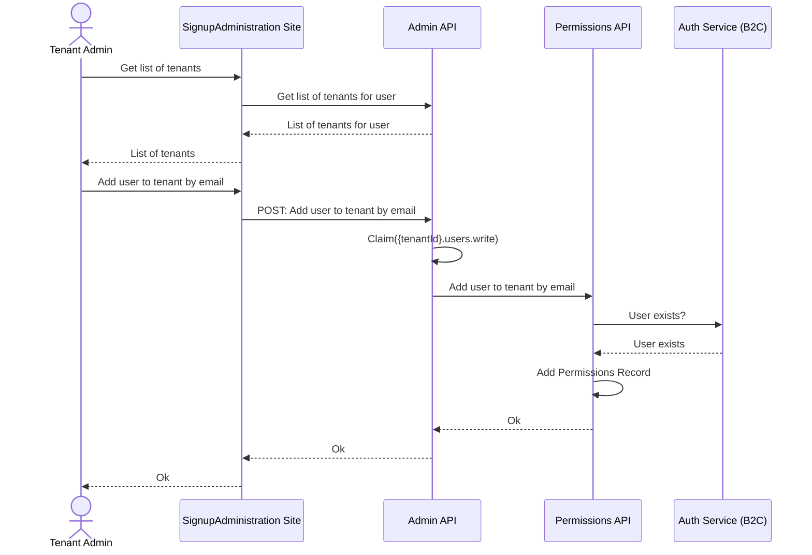
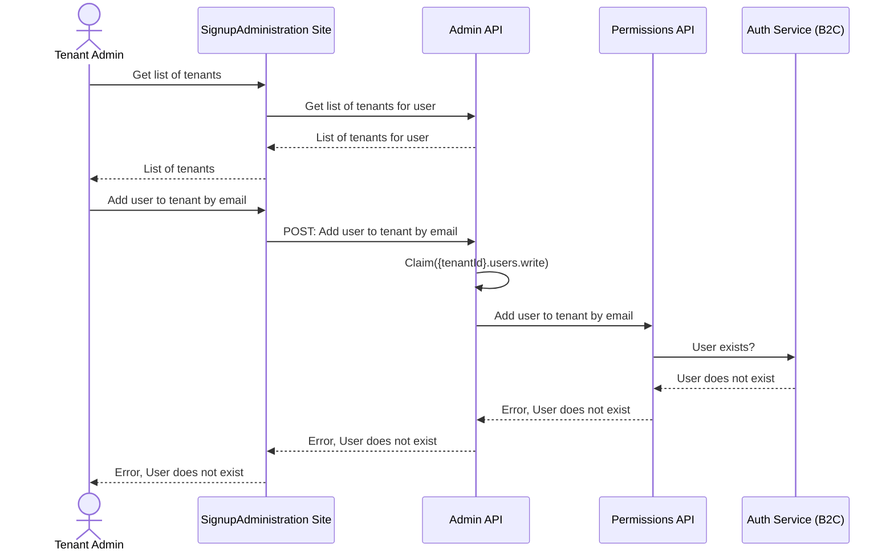

## Overview

The [SaaS.SignupAdministration.Web](https://github.com/Azure/azure-saas/tree/main/src/Saas.SignupAdministration) (aka SignupAdmin) module is a web application meant to faciliate self service onboarding to your SaaS solution. End Users/Customers can visit this site to:

- Sign up for an account

- Go through an onboarding flow to create a new tenant

- Manage their existing tenants.

This site also supports administrative functionality for global administrators to view and manage all tenants and users of the application.

## How to Run Locally

Instructions to get this module running on your local dev machine are located in the module's [readme.md](https://github.com/Azure/azure-saas/tree/main/src/Saas.SignupAdministration).

### Configuration and Secrets

A list of app settings and secrets can be found in the module's [readme.md](https://github.com/Azure/azure-saas/tree/main/src/Saas.Identity/Saas.Permissions). All non-secret values will have a default value in the `appsettings.json` file. All secret values will need to be set using the [.NET secrets manager](https://docs.microsoft.com/en-us/aspnet/core/security/app-secrets?view=aspnetcore-6.0&tabs=windows) when running the project locally, as it is not reccomended to have these secret values in your `appsettings.json` file.

When deployed to Azure, the application is configured to load in its secrets from [Azure Key Vault](https://docs.microsoft.com/en-us/azure/key-vault/general/overview) instead. If you deploy the project using our bicep templates from the Quick Start guide, the modules will be deployed to an app service which accesses the key vault using a [System Assigned Managed Identity](https://docs.microsoft.com/en-us/azure/active-directory/managed-identities-azure-resources/overview). The SignupAdmin module is also configured with [key name prefixes](https://docs.microsoft.com/en-us/aspnet/core/security/key-vault-configuration?view=aspnetcore-6.0#use-a-key-name-prefix) to only import secrets with the prefix of `signupadmin-`, as other modules share the same keyvault.

## Module Design

### Dependencies

### Consumers

### Authentication

using MSAL to auth and get token for admin service

### NSwag

## Design Considerations

For ease of management, we have chosen to incorporate the global administrative functionality into this application. You may choose to separate this functionality into a different application if you require more administrative functionality than just tenant and user management.

> We chose to use NSwag to generate our client implementation for the Admin Service. The NSwag project provides tools to generate OpenAPI specifications from existing ASP.NET Web API controllers and client code from these OpenAPI specifications. This provides us a ready-to-use HTTP client without having to write much boilerplate. Read more about [using NSwag on ASP.NET projects](https://docs.microsoft.com/en-us/aspnet/core/tutorials/getting-started-with-nswag?view=aspnetcore-6.0&tabs=visual-studio)

## FAQ and Design Considerations
- saas notifications -- current implementation vs eventing system

## Signup Administration Flows

## Sign In

See the [Sign-In Flow](./Identity/identity-flows.md##Sign-In) in Identity Flows.

## Onboarding Flow

## Add New Tenant Admin - Existing User

## Add New Tenant Admin - User Does Not Exist

