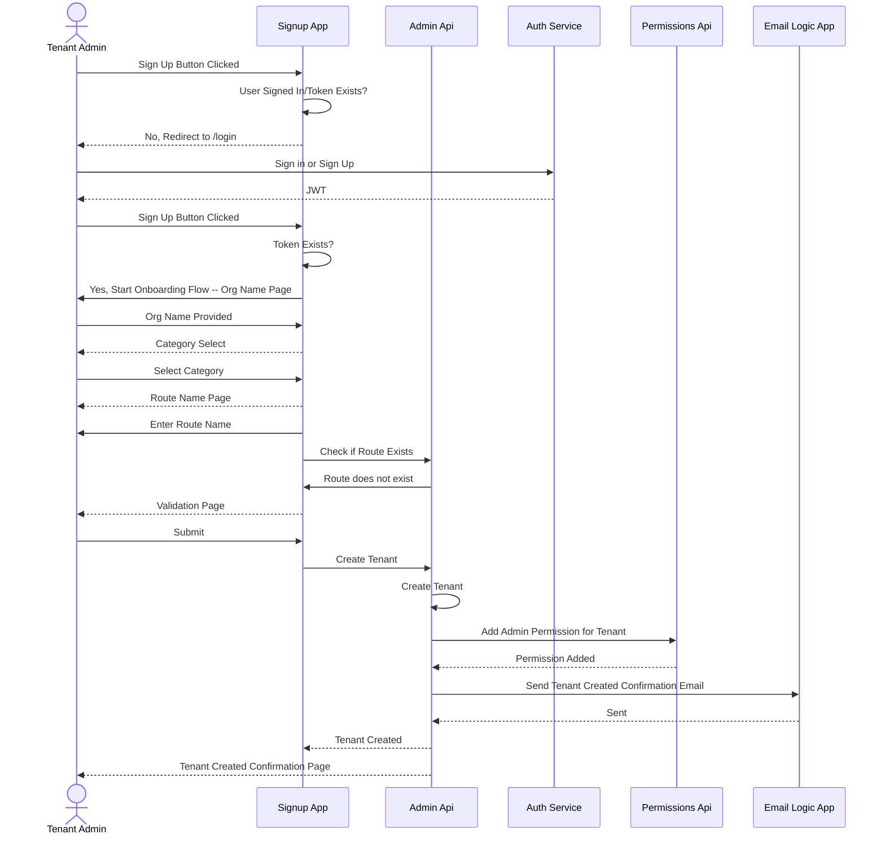
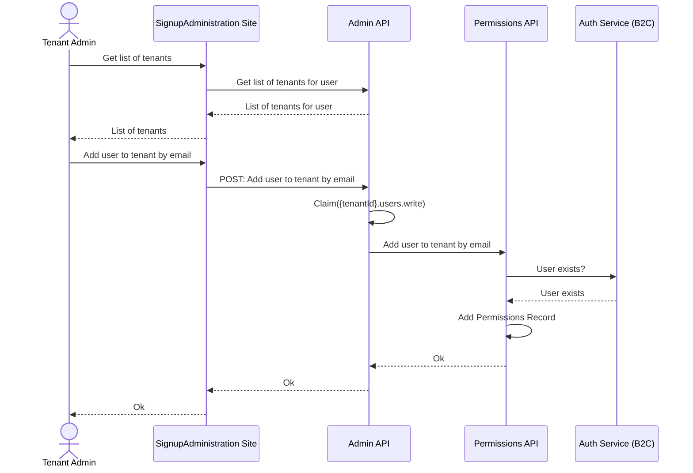
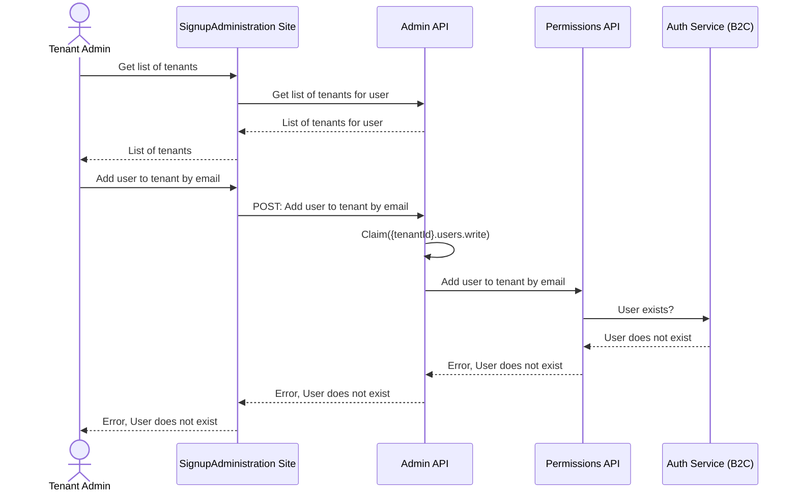

## Overview

The [SaaS.SignupAdministration.Web](https://github.com/Azure/azure-saas/tree/main/src/Saas.SignupAdministration) (aka SignupAdmin) module is a web application meant to faciliate self service onboarding to your SaaS product. End Users/Customers can visit this site to:

- Sign up for an account

- Go through an onboarding flow to create a new tenant

- Manage their existing tenants.

This site also supports administrative functionality for global administrators to view and manage all tenants and users of the application.

## How to Run Locally

Instructions to get this module running on your local dev machine are located in the module's [readme.md](https://github.com/Azure/azure-saas/tree/main/src/Saas.SignupAdministration).

### Configuration and Secrets

A list of app settings and secrets can be found in the module's [readme.md](https://github.com/Azure/azure-saas/tree/main/src/Saas.Identity/Saas.Permissions). All non-secret values will have a default value in the `appsettings.json` file. All secret values will need to be set using the [.NET Secrets Manager](https://docs.microsoft.com/en-us/aspnet/core/security/app-secrets?view=aspnetcore-6.0&tabs=windows) when running the module locally, as it is not recommended to have these secret values in your `appsettings.json` file.

When deployed to Azure, the application is configured to load in its secrets from [Azure Key Vault](https://docs.microsoft.com/azure/key-vault/general/overview) instead. If you deploy the project using our ARM/Bicep templates from the Quick Start guide, the modules will be deployed to an app service which accesses the Azure Key Vault using a [System Assigned Managed Identity](https://docs.microsoft.com/en-us/azure/active-directory/managed-identities-azure-resources/overview). The SignupAdmin module is also configured with [key name prefixes](https://docs.microsoft.com/en-us/aspnet/core/security/key-vault-configuration?view=aspnetcore-6.0#use-a-key-name-prefix) to only import secrets with the prefix of `signupadmin-`, as other modules share the same Azure Key Vault.

## Module Design

### Dependencies

- [SaaS.Admin.Service](../admin-service)
  - Depends on the SaaS.Admin.Service for CRUD operations on tenant records, as well as to broker the connection to the SaaS.Permissions.Service for CRUD operations on permissions records.
- [Identity Provider](../identity/identity-provider)
  - Depends on the identity provider to authenticate users and receive a JWT token.
- [SaaS.Notifications](../saas-notifications)
  - Depends on the SaaS.Notifications logic app to send transactional emails to users

### Consumers

- End Users/Customers

### Authentication

The SignupAdmin site uses the [Microsoft Authentication Library (MSAL)](https://docs.microsoft.com/azure/active-directory/develop/msal-overview) to handle the [flow](../identity/identity-flows#sign-in) of signing in and parsing the user token from the Azure AD B2C. The identity provider must be configured properly for this to work, and you must provide certain configuration values to the SignupAdmin site for it to properly communicate with Azure AD B2C. These config values can be found in the module's [readme.md](https://github.com/Azure/azure-saas/tree/main/src/Saas.SignupAdministration).

For communication with the SaaS.Admin.Service, the SignupAdmin site also uses the MSAL to request an access token, using the signed-in user's existing token, to use in the Authorization header of all requests. This new token is specific to the SaaS.Admin.Service and will be requested from the Identity Provider with a specific scope. This type of exchange is known as an [OAuth 2.0 On-Behalf-Of Flow](https://docs.microsoft.com/azure/active-directory/develop/v2-oauth2-on-behalf-of-flow).

### NSwag

The NSwag project provides tools to generate OpenAPI specifications from existing ASP.NET Web API controllers and client code from these OpenAPI specifications. This provides us a ready-to-use HTTP client without having to write much boilerplate. Read more about [using NSwag on ASP.NET projects](https://docs.microsoft.com/en-us/aspnet/core/tutorials/getting-started-with-nswag?view=aspnetcore-6.0&tabs=visual-studio).

<!-- TODO: Add nswag config to project. -->
<!-- You can also find the nswag configuration file we used to generate the client in this folder. -->

### Transactional Emails

When a new tenant is created, the SignupAdmin site will make a REST call to the [SaaS.Notifications](../saas-notifications) module. This module is an [Azure Logic App](https://docs.microsoft.com/en-us/azure/logic-apps/logic-apps-overview) that gets deployed with a basic endpoint that accepts an email request. You must configure your email provider in this logic app post deployment before emails will actually send from the SignupAdmin site.

## FAQ and Design Considerations

- For the onboarding workflow, we are keeping track of the state in memory. This is fine for demo purposes and low traffic systems, but this is not a great pattern when introducing horizontally scaled backends. It is recommended that you replace the JsonPersistenceProvider (the service that stores the state) with another implementation backed by an external cache (ex: Redis, CosmosDB, etc). Instructions on where to do this can be found in the module's [readme.md](https://github.com/Azure/azure-saas/tree/main/src/Saas.SignupAdministration)

- Q: How do I manage tenants created by this application?
  - A: For ease of management, we have chosen to incorporate the global administrative functionality into this application. You may choose to separate this functionality into a different module if you require more administrative functionality than just tenant and user management

- Q: What other implementation options exist for email notifications?
  - A: A better solution for sending transactional emails might be to emit an event or message from the application, and building a notifications system to subscribe to those events. You could then build other applications to consume those events for other business functions as well. This style of architecture is called an [Event Driven](https://docs.microsoft.com/en-us/azure/architecture/guide/architecture-styles/event-driven) architecture. We decided to not go this route (yet!) with this project to keep it simple, but it is something to be considered when looking at your overall technical landscape.

## Signup Administration User Flows

### Sign In

See the [Sign-In Flow](./Identity/identity-flows.md##Sign-In) in Identity Flows.

### Onboarding Flow

### Add New Tenant Admin - Existing User

### Add New Tenant Admin - User Does Not Exist

