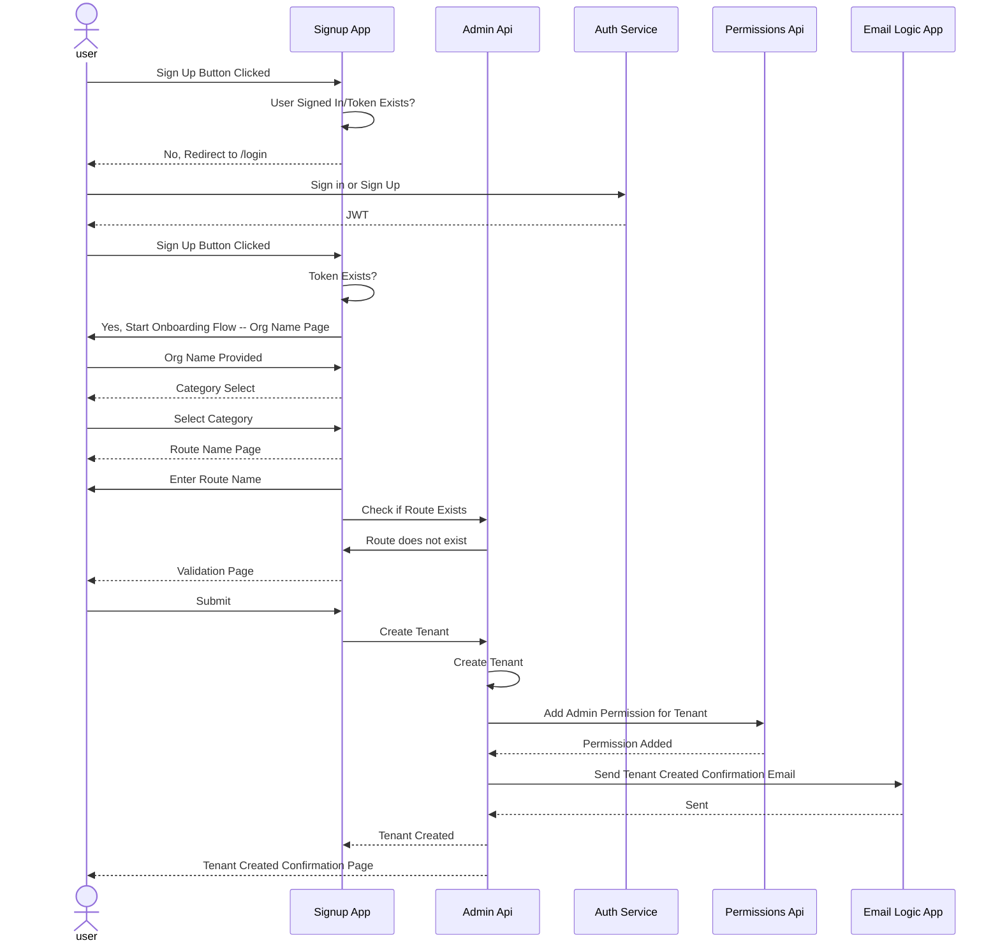
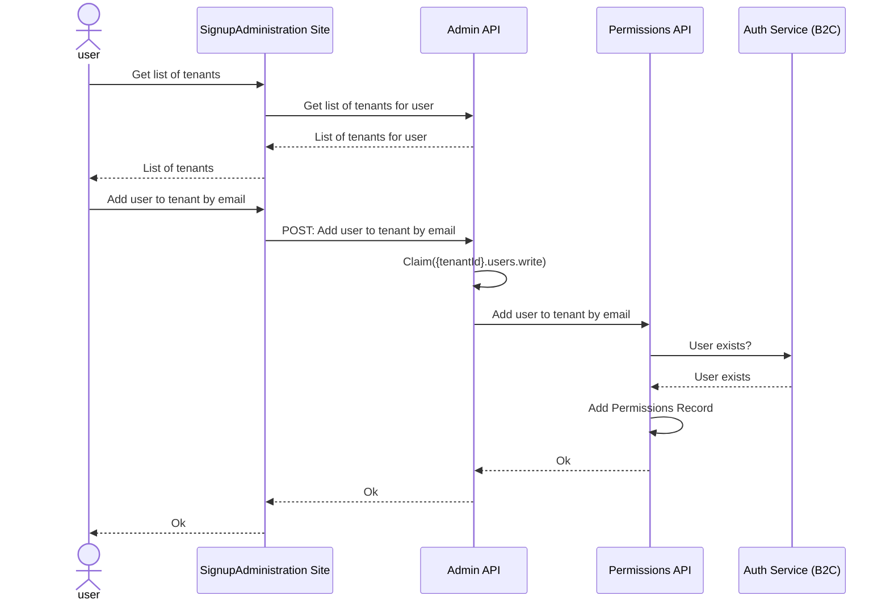
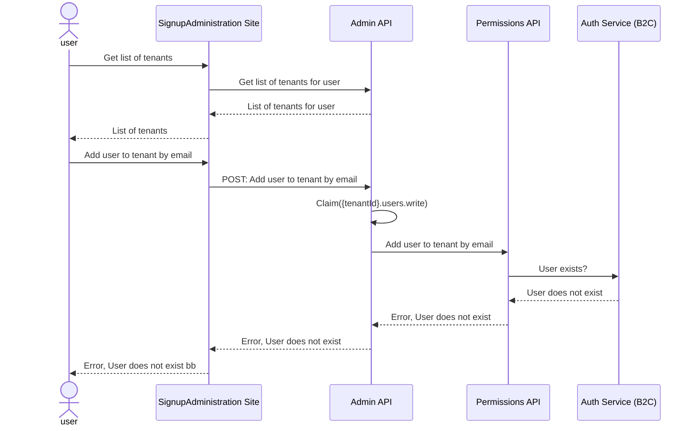

## Design Considerations
## Running Locally

Instructions to get this module running on your local dev machine are located here:
https://github.com/Azure/azure-saas/tree/main/src/Saas.SignupAdministration

## Signup Administration Flows

## Sign In

## Onboarding Flow

## Add New Tenant Admin - Existing User

## Add New Tenant Admin - User Does Not Exist

