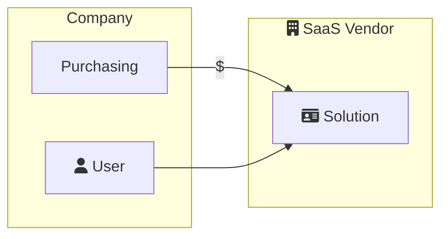
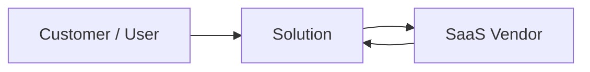
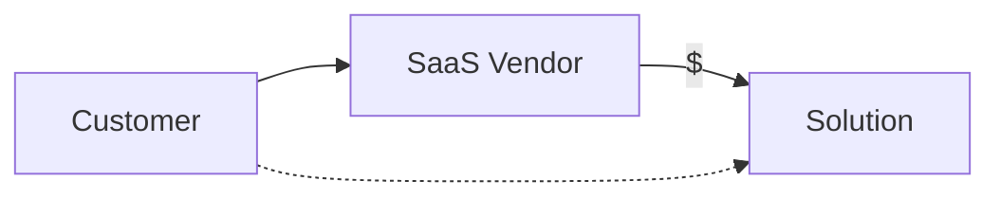

As a SaaS vendor, it's useful to understand where your branding ends, and the vendor branding begins. In other words, how will your software solution be positioned for your customer base.

> **Identity** plays a critical role within SaaS solutions. It's an area where extra planning early in your design is recommended.

## Common Customer Scenarios

These are common scenarios from the perspective of the customer / user. Understanding which scenario best aligns 

### Scenario 1 - Pure B2B

**User** works at a company that has purchased software for their employees to use. The user generally logs on with their corporate identity.

Examples: Yammer, Adobe, QuickBooks

### Scenario 2 - Marketplaces

**Customer** is purchasing *something* from an ISV directly. There may also be a vendor paying the ISV.

Examples: Ticketmaster, eBay, Etsy, AirBnB, Instacart

### Scenario 3 - White Label or Embedded

**Customer** is purchasing from a vendor directly, and that vendor is using a SaaS solution provided by an ISV.

Examples: Shopify, Square, Wix

Note: It is also possible in some cases that the customer doesn't pay the vendor. For example, SquareSpace or Wix.