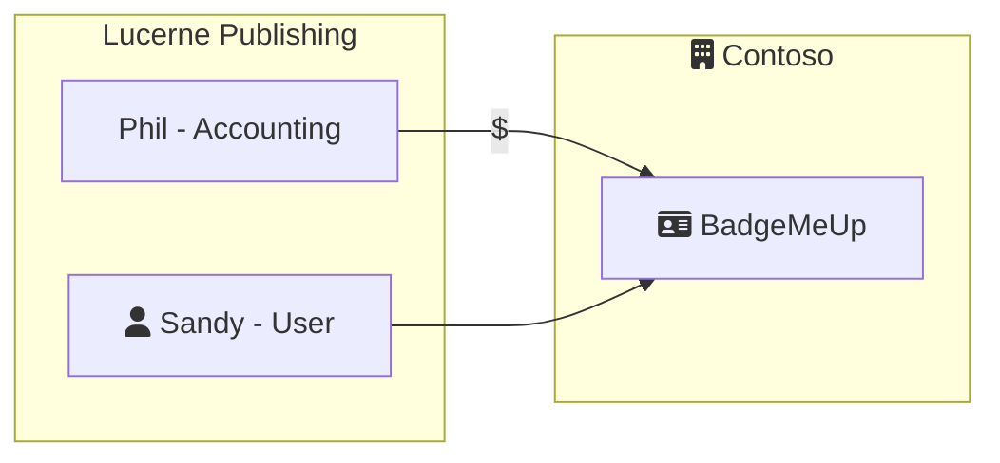

## Intro

For ease of explaining the project and who it might benefit, we created an example "story" to help users visualize the components. In the story below, Contoso is ISV who developed the BadgeMeUp SaaS platform and Lucerne Publishing is the customer who purchased BadgeMeUp for use by employees within their organization.

## Context

Contoso is a SaaS ISV (software vendor) that has a product, Contoso BadgeMeUp. Contoso BadgeMeUp is a SaaS B2B application that Contoso sells to companies that want a great tool to improve the culture within their organization.

> For more information about how this SaaS architecture compares to others, please see *Scenario 1* in [SaaS Branding Considerations](../branding-considerations-for-saas/#scenario-1---pure-b2b).

Lucerne Publishing has recently purchased Contoso BadgeMeUp. They're currently using Azure Active Directory and want their employees to be able to Single Sign-on to BadgeMeUp.

> Note: Contoso IT has configured their Azure AD B2C instance for an external authentication provider. Additional documentation is available [here](https://docs.microsoft.com/en-us/azure/active-directory-b2c/identity-provider-azure-ad-multi-tenant?pivots=b2c-user-flow).

### Onboarding

1. Phil in Lucerne Publishing accounting browsed the plans available at Signup.BadgeMeUp.Contoso.com and selected the plan he thought would best fit the company's needs.
2. Sandy navigates to BadgeMeUp.Contoso.com/lucernepublishing and signs in using her Microsoft Entra credentials.
3. After Sandy creates an account, Phil can then go to Signup.BadgeMeUp.Contoso.com/admin to see his previously created tenant and grant Sandy elevation permissions if he wishes. 

