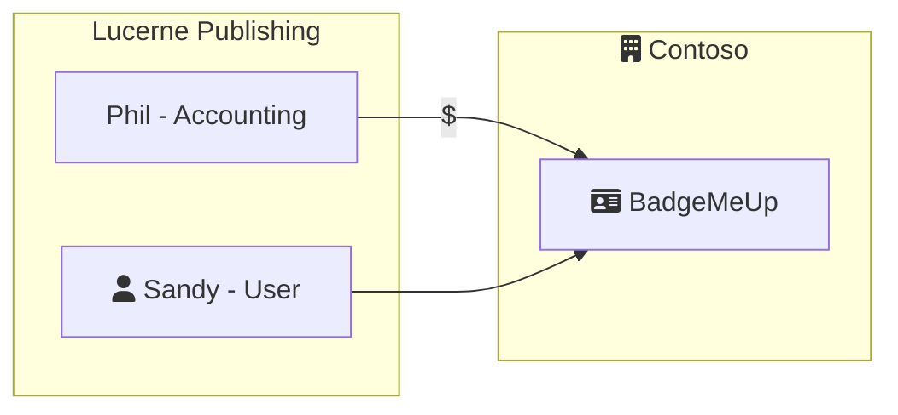

## Context

Contoso BadgeMeUp is a SaaS B2B application that Contoso sells to companies that want a great tool to improve the culture within their organization.

> For more information about how this SaaS architecture compares to others, please see *Scenario 1* in [SaaS Branding Considerations](../branding-considerations-for-saas/#scenario-1---pure-b2b).

Lucerne Publishing has recently purchased Contoso BadgeMeUp. They're currently using Azure Active Directory and want their employees to be able to Single Sign-on to BadgeMeUp.

> Note: Contoso IT has configured their B2C instance for an external authentication provider. Additional documentation is available [here](https://docs.microsoft.com/en-us/azure/active-directory-b2c/identity-provider-azure-ad-multi-tenant?pivots=b2c-user-flow).

### Onboarding

1. Phil in accounting browsed the plans available at BadgeMeUp.Contoso.com and selected the plan he thought would best fit their companies needs.
2. Sandy navigates to BadgeMeUp.Contoso.com and is automatically signed on with her companies credentials.

> Note: Currently, Sandy has to sign up for the service. **How do we simplify?**