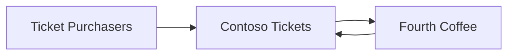

## Context

Contoso Tickets is a SaaS application that Contoso sells to venues that want to outsource the complexities around selling tickets to events at their venue.

> For more information about how this SaaS architecture compares to others, please see *Scenario 2* in [SaaS Branding Considerations](../branding-considerations-for-saas/#scenario-2---marketplaces).

## Scenario

Fourth Coffee brings in local bands every Friday and Saturday evening. Due to the high demand, they sell tickets. Fourth Coffee decided to utilize the Contoso Tickets platform since many people are already familiar with the platform, and it would be costly to build their own.

## Roles

### Onboarding

1. Doug, the manager at Fourth Coffee navigated to the Contoso Tickets website (tickets.Contoso.com) and signed up for a plan, adding the venue to the site with a unique URL (tickets.Contoso.com/FourthCoffee).
2. *Existing* users can buy tickets through the site like they always have, and the new venue is available to them. *New* users are asked to create an account to purchase tickets.