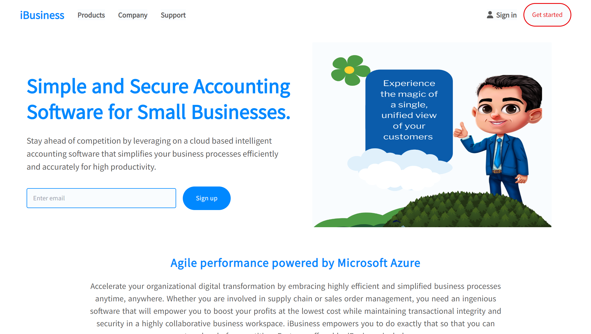

# iBussiness Design

## By Maurice Nganga
## By James Maina
## By Joseph Mwita

## Table of Content

- [Development](#development)
- [Instructions](#instructions)
- [Live Link](#live-link)
- [Setup Instructions and Technology](#technology-used)
- [License](#license)

## Development

### Available Scripts

In the project directory, you can run:

#### USING NPM

`UnZip the project`

`npm install`

`npm run start`

`npm run build`

## Instructions

### To have the admin privileges then you have to do the following.

Use this admin credentials to login as admin:
   -  email: ibizsample123@outlook.com
   -  password: pass123@1

- If you are in the landing page  click on the signin buttton and that will take you to the login page.

- Click on Login with Microsoft and this will redirect you to login in with from microsoft platform.

- On successful login you'll find yourself in the dashboard where all the bookings will be loaded in the grid.

- Here you can create new booking and update a booking and also edit the data on the datagrid. Right cliking on a row on the grid will display contect menu where you can chose commands to purform.

- On the sidebar under Proccess Menu the 'Purchase Order' menu will redirect you to the Orders page.

- On the orders page, you can double click on an order to redirect you to the purchase order's editing page. Also while on the orders page
the user can click on the 'New' button on top of the table to create a purchase order.

- The purchase order entry page persists data incase the user exits the page unexpectedly, perhaps he/she logged out or the device went offline, the user will still access the order information inputed before submission even on another device. This feature is complemented by the use of Azure CosmosDB.

- On completion of entering the order information, the user can click 'Submit Order' to submit the order, or click 'Close' to go back to the orders page.

### Technology Used

---

- **React** - help in creating interactive website

- **DevExtreme** - component was used to add basic tables and data grids in the dashboard to display the bookings, order items  and purchase orders. As well as adding form controls in the website.

- **Redux** - to help persist a logged in user and modules across all pages in the website and enable them with accessibility privilages.

- **Azure SQL Server** - We used Azure SQL Server as the database.

- **Azure CosmosDB** - Azure CosmosDB is used to store temporary purchase order form data and also to fetch menus from the web.

- **.NET Core** - This is used as the API for the app.

## Login feature
Only supported login/registration endpoint is loggin with Microsoft. It supports the following.
1. First time login in: When a user tries to access the system via Microsoft for the first time, they are redirected to a window with outfilled graph information. They are then requried to provide additional information that the system can use to full understand them. In this prototype, such information include physical address, phone number and country of origin. Such information may or may not be provided from Microsoft graph (user profile)
2. In subsquent login, a user is simply logged in to the application without further restrictions. 

Another key feature implemented is token encryption. The backend system uses JWT token, however, the token is encrypted before it can be sent to the front end. when received from front-end it will be decrypted before it can be verified then used. The importance of encryption is to add another layer of security. Since JWt token contains senstive information but can be viewed by any JWt token viewer, it is recommendable to obsecure it.

### Live Link

---

\- Click this link to see the live website [iBusiness](https://ibusiness-git-main-moryno.vercel.app/)

## License

---

MIT License

Copyright (c) [2023] [Maurice Nganga]

Permission is hereby granted, free of charge, to any person obtaining a copy
of this software and associated documentation files (the "Software"), to deal
in the Software without restriction, including without limitation the rights
to use, copy, modify, merge, publish, distribute, sublicense, and/or sell
copies of the Software, and to permit persons to whom the Software is
furnished to do so, subject to the following conditions:

The above copyright notice and this permission notice shall be included in all
copies or substantial portions of the Software.

THE SOFTWARE IS PROVIDED "AS IS", WITHOUT WARRANTY OF ANY KIND, EXPRESS OR
IMPLIED, INCLUDING BUT NOT LIMITED TO THE WARRANTIES OF MERCHANTABILITY,
FITNESS FOR A PARTICULAR PURPOSE AND NONINFRINGEMENT. IN NO EVENT SHALL THE
AUTHORS OR COPYRIGHT HOLDERS BE LIABLE FOR ANY CLAIM, DAMAGES OR OTHER
LIABILITY, WHETHER IN AN ACTION OF CONTRACT, TORT OR OTHERWISE, ARISING FROM,
OUT OF OR IN CONNECTION WITH THE SOFTWARE OR THE USE OR OTHER DEALINGS IN THE
SOFTWARE.
