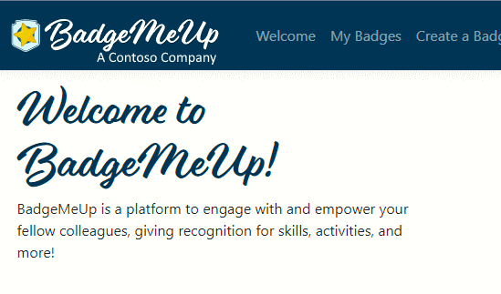

# Saas.Application.Web

This project is a sample tenant-aware application. *This is where you'll put your own code*.

This sample default application is **Contoso BadgeMeUp**. It is easy to run the application locally to explore how it works within the context of the other SaaS modules.

Contoso BadgeMeUp is a simple SaaS B2B application that Contoso sells to companies that want a great tool to improve the culture within their organization.

## Additional Resources

* You'll need to configure your B2C instance for an external authentication provider. Additional documentation is available [here](https://docs.microsoft.com/en-us/azure/active-directory-b2c/identity-provider-azure-ad-multi-tenant?pivots=b2c-user-flow).