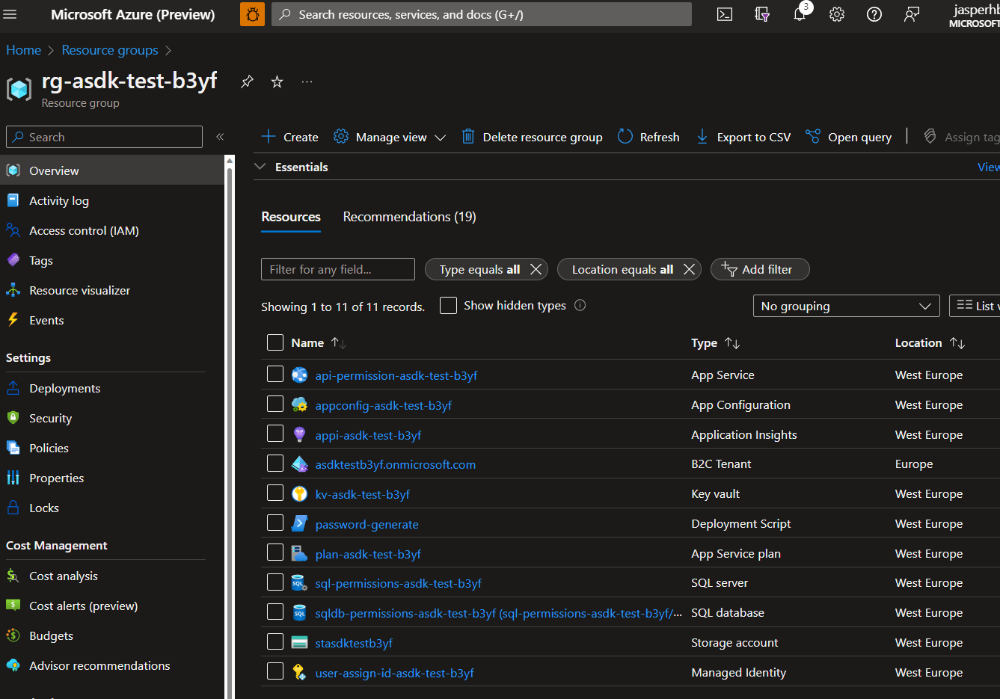

# Deploying the Identity Foundation Services

This deployment script provisions and configures the Azure services defining the SaaS Identify Foundation, which is back-bone of the Azure SaaS Dev Kit. 

## Before You begin

Before you begin, you should [fork](https://docs.github.com/en/get-started/quickstart/fork-a-repo) this GitHub repository to you own GitHub account - i.e., make it your own. 

 A main purpose of the Azure SaaS Dev Kit is to boost your SaaS journey by providing a foundation for a solid start. It is however just a start and soon you will want to make your own changes, evolve the repo into something that is yours. By start with forking the repository, you will be ready to [commit](https://github.com/git-guides/git-commit) and check in your own code to your own repository of the ASDK.

## Run the deployment script in a container, using docker (recommended)

> Tip: Although using a container, utilizing Docker, to run the script is the recommended approach, you'll find the steps to run the script without a container in a later section below. 

### Prerequisites 

The following platforms are supported:

- Microsoft Windows 10/11, running the latest updates.
- Apple Mac (Intel or Apple Silicon based) with a recent version of MacOS (Ventura or later recommended).
- Linux, like Ubuntu 22.04.

#### Microsoft Windows 10/11

Running on Windows 10/11 requires that [Windows Subsystem for Linux (WSL)](https://learn.microsoft.com/en-us/windows/wsl/install) have been enabled. WSL can be downloaded from the [Windows Store](https://www.microsoft.com/store/productId/9P9TQF7MRM4R). 

WSL lets you run a GNU/Linux environment (including [bash](https://www.gnu.org/software/bash/)) on Windows 10/11 without any modifications and without the need of a virtual machine.

We suggest using [Ubuntu 22.04](https://releases.ubuntu.com/22.04/) on Windows, which can also also be downloaded from the [Windows Store](https://www.microsoft.com/store/productId/9PN20MSR04DW).

#### Tools

No matter the operating system you're using, you will need these tools to be installed:

- [**Docker Desktop**](https://docs.docker.com/get-docker/). 
  - If you have Docker already, make sure to get the latest updates before you begin. If you have Docker installed but haven't used it for a while. Reinstalling will often solve potential issues.

- [Azure Command Line Interface (**az cli**)](https://learn.microsoft.com/en-us/cli/azure/what-is-azure-cli) from the terminal: [How to install the Azure CLI](https://learn.microsoft.com/en-us/cli/azure/install-azure-cli).
- [GitHub’s official command line tool (**gh**)]([GitHub CLI | Take GitHub to the command line](https://cli.github.com/)). For more on installation see [here](https://github.com/cli/cli#installation).
- **Zip** which can be installed with the command: `sudo apt install zip` . 
  - Note: **zip** is already installed on MacOS per default.


### Why use a container?

There are two ways to run this deployment script. The recommended way to run the script is using a container that you build using [docker](https://docs.docker.com/get-docker/). 

This containerized approach will ensure that you have all the required dependencies installed and that you are running the script in a controlled environment. It will also minimize the chances that some other properties of your existing environment interferes with the script or that the script inadvertently interferes with your existing environment.

> Tip: On Windows 10/11, if you experience the error: *"The command 'docker' could not be found in this WSL 2 distro. We recommend to activate the WSL integration in Docker Desktop settings."*, then try to restart Docker Desktop or if that doesn't help, try and reinstall it. 

### Begin

To begin; open your GNU Linux terminal to the directory where you've [cloned](https://docs.github.com/en/repositories/creating-and-managing-repositories/cloning-a-repository) the [forked](https://docs.github.com/en/get-started/quickstart/fork-a-repo) version of ASDK. Should be something like:

````bash
.../src/Saas.Identity/Saas.IdentityProvider/deployment
````


> Tip: You can open the deployment project in Visual Code by typing `code .` in the terminal (Mac or Windows with WSL) from the directory.

### Building the deployment script container

To run the script you must first setup of the deployment environment and build the container. To do this, run the following commands:

```bash
chmod +x setup.sh # only needed the first time to set execute permissions on setup.sh
./setup.sh
```

This will take a few minutes to complete and you will only need to do it once, as long as you make no changes to the `Dockerfile`. The container will be named `asdk-script-deployment`.

If you make changes to `Dockerfile` you can update the container by running `./build.sh` again.

### Running the deployment script using the container

When the container build have completed, run the script with the following commands:

```bash 
chmod +x run.sh # only needed the first time to set execute permissions on run.sh
./run.sh
```

This will instantiate the container and mount the current root directory as a volume accessible from within the container. 

Mounting the root directory means that any edits to `config.json` or anything any of the script files will immediately becomes effective without having to re-build the container. All you need to do is tun `./run.sh` and any changes you've  made will now be effective.

### Logging into az cli

To ensure that you are correctly logged into your Azure tenant, please run this command and follow the instructions. 

```bash
az login --scope "https://graph.microsoft.com/.default"
```

###  Running the script the first time

The first time you run the script, the script will automatically create a new instance of the file `./config/config.json`  (a copy of `./config/config-template.json`), after which the script will exit immediately with a request for additional information to be added to the configuration manifest in `config.json`. 

Specifically, the `initConfig` section must be filled out (see more details below):

```json
{
  "initConfig": {
    "userPrincipalId": "123e4567-e89b-12d3-a456-426652340000",
    "subscriptionId": "123e4567-e89b-12d3-a456-426652340000",
    "tenantId": "123e4567-e89b-12d3-a456-426652340000",
    "location": "enter the geo location, for instance 'westeurope'",
    "naming": {
      "solutionPrefix": "asdk",  // 'asdk' is the default prefix used
      "solutionName": "test" // leave as 'test' or change to some other name
    },
    "azureb2c": {
      "location": "Europe", // enter a valid Azure B2C region here. This is not the same as 'location' above.
      "countryCode": "DK", // enter a valid country code.
      "skuName": "PremiumP1", // can be Standard, PremiumP1 or PremiumP2.
      "tier": "A0" // leave this as 'A0'
    }
  },... // leave the remaining part of the configuration manifest unchanged for now.
```

### User Principal Id

Get the `userPrincipalId` by running the following command, which will respond with a GUID:

```bash
az login # only do this if you're not logged in already
az ad signed-in-user show --query id
```

> Note: The reason that the script doesn't pull the `userPrincipalId` automatically, is that some organizations may require that this particular command can only be run from a *manage device*. Because the deployment script is run from inside a container this, the command may throw an error: "*AADSTS530003: Your device is required to be managed to access this resource.*", even if the device that the container is on, is managed.

### Azure Subscription Id

You may have multiple Azure subscriptions and thus manually choosing which subscription you want to use is the most practical approach for filling in the `subscriptionId`value. You'll find your subscriptions in the [Azure Portal on the subscriptions page](https://ms.portal.azure.com/#view/Microsoft_Azure_Billing/SubscriptionsBlade), the value should be a GUID.

Alternatively, get a list of your subscriptions of the tenant that you are logged into by running the az cli command and choose the one you want to use here:

```bash
 az account subscription list --query "[].{DisplayName:displayName, Id:id}" --output table
```

###  Tenant Id

Get the `tenantId`by running the following command, which will respond with a GUID.

```bash
az login # only do this if you're not logged in already
az account show --query tenantId
```

> Note: The `id` that is returned by `az account show` is **not** the `userPrincipalId` required here.

### Location

To get a list of valid locations run this command:

```bash
az account list-locations --output table
```

### The other values

Other values in `initConfig`:

| Value                  | Default   | Comment                                                      |
| ---------------------- | --------- | ------------------------------------------------------------ |
| `solutionPrefix`       | asdk      | The suggestion is to leave it as-is.                         |
| `solutionName`         | test      | The suggestion is to lead it as default or limit it to four letters. |
| `azureb2c/location`    | N/A       | Note that this is not the same as the location above, but is rather the names of the Azure AD regions available. Unfortunately, there's currently no command available for getting the list. |
| `azureb2c/countryCode` | N/A       | An available ISO country code                                |
| `azureb2c/skuName`     | PremiumP1 | Available options are `Standard`, `Premium1` and `Premium2`  |
| `azureb2c/tier`        | A0        | No known alternatives at the moment, please leave it as-is.  |

### Running the script 

After you've added the values outlined above to `config.json` you're ready to run the script again. 

While running the script the second time, you will be asked to log in once, and maybe twice. 

1. The first log in, is for your main Azure tenant. This step will likely be skipped since you are already logged in to the specified tenant - i.e., using `az login --scope "https://graph.microsoft.com/.default"`

   > Tip: The script is smart enough to utilize your existing  Azure token, that is cached for your main az cli session, outside of the container. 

2. The second login cannot be avoided, since it is for logging into the Azure B2C Tenant that have just been created. This login is needed to make further changes to the Azure B2C tenant. 

   > Note: The script will cache the login session, so that if you need to run the script multiple times, you will not be asked to log in again. This login session for Azure B2C is cached here: `$HOME/asdk/.cache/`.

## Running deployment script on your computer without docker (not recommended)

While not recommended, you can also run the deployment script *bare-bone* on you computing without using a container. It will generally run slower and since the run environment is not as controlled as when running the script using a dedicated container, there is a higher risk for something not working. That said, the script is tested for this and will work in most circumstances.

The script have been tested on:

-  Windows 10/11 running in WSL with a Ubuntu 22.04 distro.
-  Ubuntu 22.04.
-  MacOS Ventura. 13.1+, including MacOS running on Apple Silicon.
-  While not tested on other configurations, it will likely run recent Linux distros and versions as well as and earlier and recent versions of MacOS too.

Make sure that you have all the tools mentioned above as well as the following installed on your machine before running the script:

- [JQ v1.6+](https://linuxhint.com/bash_jq_command/) for Bash.
- [GitHub’s official command line tool (gh)](https://github.com/cli/cli#installation)
- Specifically on MacOS, you'll need a more recent of `bash` as the default version is rather old. 
  - To do this you can use homebrew: [`brew install bash`](https://formulae.brew.sh/formula/bash).


When these requirements are met, the script can be run using the following command:

```bash
chmod +x start.sh
./start.sh
```

From there on everything else is virtually identical to running the script from inside a container, as described above.

## What if something goes wrong?

It should happen, but it does. In most cases, if something goes wrong along the way, all you'll need to do is to run the script again and it will skip the parts that have already been completed and re-try the parts that have not.

> Tip #1: If something goes wrong with for instance the the App Registrations, try deleting all of them (or at least the one that is not correct) and then run the script again. Doing so will recreate the app registrations. 
>
> Tip #2: Please be aware that when you dele an App Registration it will move to `Deleted applications` and you will have to delete the deleted registration too using `Delete permanently` to fully purge it.
>
> Tip #3: Deleting an entity and then running the script again is a general a good suggestion for if you want to make changes. The script is designed with resilience in mind.

If the script fails you may use the logs to investigate the issue. The logs are found in the [log](./log) directory in the project root. Every time the script is run a new folder with the time/date of the event is created. Inside this folder the `config.json` manifest file is stored twice. Once as it looks in the beginning of the script run and once who it looks at the end. The `config.json` manifest is an important file, if you need to run the script again.

> Tip : The `config.json`and the logs are both excluded from the any git commit made on the project as defined in `.gitignore`. This is done for both practical reasons and security reasons. However, each time you run the script, both the logs and the configuration files are uploaded and stored in an Azure Storage Account in you Azure Resource Group.

## Now what?

The deployment script has run to it's completion and the Identity Framework have been deployed - providing that nothing went wrong, of course. 

### Inspecting the Identity Foundation in the Azure Portal.

The Identity Framework is gathered in an Azure Resource group. In the Azure Portal it will look something like this: 



### Adding Modules

With the Identity Foundation in place, it's time to kick the tires of the Azure SaaS Development Kit. The next step should be to add the ASDK Permission Service API, which is a core component. 

We suggest that you run the Permission API service locally first. This will give you an opportunity to attach a debugger to it to explore and learn more about what's going on. 

So, please head over to the [Permission Service ReadMe](../../Saas.Permissions/readme.md), for more details on running the Permission API Service locally, as well as deploying it to Azure, when you are ready to do so.

> Tip: The Permission Service is part of the repository that you *git cloned*, after you *git forked* it. You'll find it here: `.../src/Saas.Identity/Saas.Permissions`.

