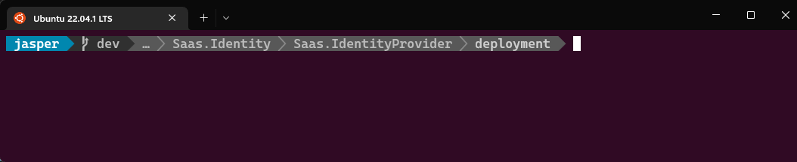
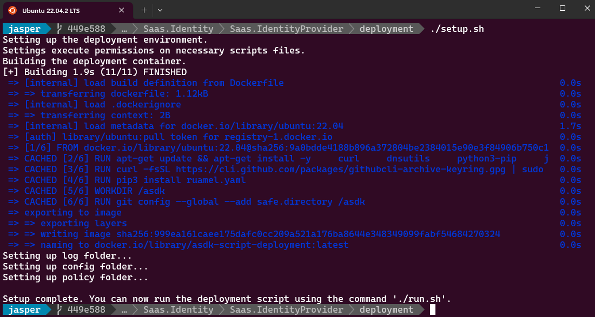
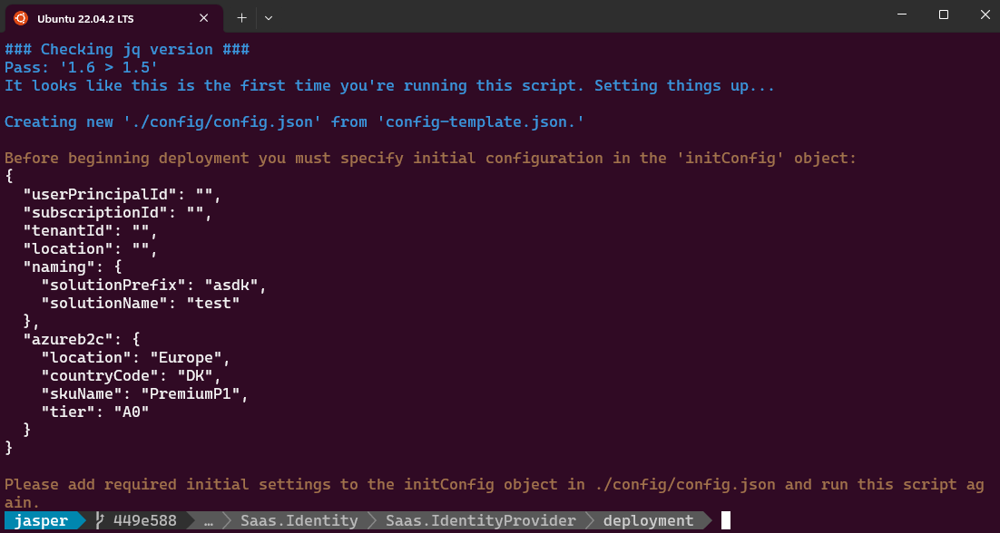
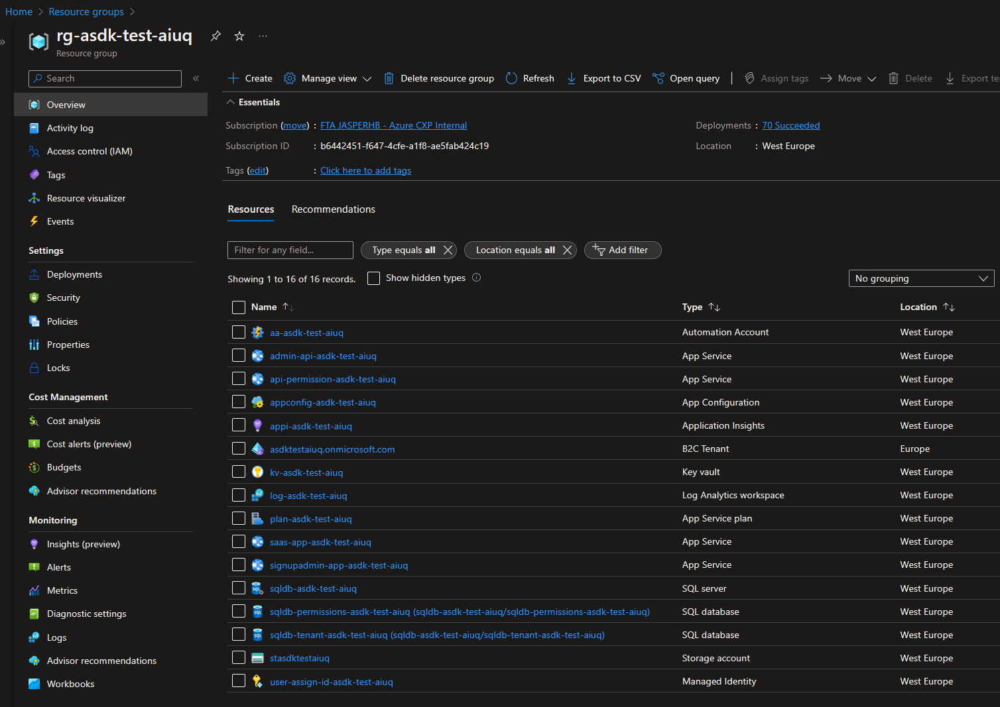

# Deploying the Identity Foundation Services

This deployment script provisions and configures the Azure services defining the SaaS Identify Foundation, which is back-bone of the Azure SaaS Dev Kit. 

## Before You begin

Before you begin, you should [fork](https://docs.github.com/en/get-started/quickstart/fork-a-repo) this GitHub repository to you own GitHub account to make it your own.

> Tip: Sign up to GitHub for free: [join](github.com/join).

### Purpose

The purpose of the Azure SaaS Dev Kit is to boost your SaaS journey by providing a foundation and a solid start. It is however just a start and soon you will want to make your own changes and evolve the repo into something that is yours.

By starting by forking the repository, you will be ready to [commit](https://github.com/git-guides/git-commit) and check in your own code to your own repository of the ASDK from the very beginning. You will also be able to leverage [GitHub Actions](https://github.com/features/actions) to deploy you're code and updates to production seamlessly.

For more details please read the [FAQ](./faq.md):

## Running the Deployment Script

Running the deployment script requires utilizing a container and Docker. 

### Prerequisites 

The following platforms are supported:

- Microsoft Windows 10/11, running the latest updates.
- Apple Mac (Intel or Apple Silicon based) with a recent version of MacOS (Ventura or later recommended).
- Linux, like Ubuntu 22.04.

#### Specifics Regarding Microsoft Windows 10/11

Running the deployment script from a Windows 10/11 PC, requires that [Windows Subsystem for Linux (WSL)](https://learn.microsoft.com/en-us/windows/wsl/install) is  enabled. WSL can be downloaded and enabled freely from the [Windows Store](https://www.microsoft.com/store/productId/9P9TQF7MRM4R). 

WSL lets you run a GNU/Linux environment (including [bash](https://www.gnu.org/software/bash/)) on Windows 10/11 without any modifications and without the need of a virtual machine.

We suggest using [Ubuntu 22.04](https://releases.ubuntu.com/22.04/) on Windows, which can also also be downloaded from the [Windows Store](https://www.microsoft.com/store/productId/9PN20MSR04DW), after WSL have been enabled.

#### Tools

No matter the operating system you're using, you will need these tools to be installed locally:

- [**Docker Desktop**](https://docs.docker.com/get-docker/). 
  - If you have Docker already, make sure to get the latest updates before you begin. If you have Docker installed but haven't used it for a while. Reinstalling will often solve potential issues.
  - Tip: On Windows 10/11, if you experience the error: *"The command 'docker' could not be found in this WSL 2 distro. We recommend to activate the WSL integration in Docker Desktop settings."*, then try to restart Docker Desktop or if that doesn't help, try and reinstall it. 
- [Azure Command Line Interface (**az cli**)](https://learn.microsoft.com/en-us/cli/azure/what-is-azure-cli) from the terminal: [How to install the Azure CLI](https://learn.microsoft.com/en-us/cli/azure/install-azure-cli).
  - Tip: Must be installed from inside WSL on Windows 10/11).

- [GitHub’s official command line tool (**gh**)](https://cli.github.com/). For more on installation see [here](https://github.com/cli/cli#installation).
  - Tip: Must be installed from inside WSL on Windows 10/11).


### Begin

To begin, please open your GNU Linux terminal to the directory where you've [cloned](https://docs.github.com/en/repositories/creating-and-managing-repositories/cloning-a-repository) the [forked](https://docs.github.com/en/get-started/quickstart/fork-a-repo) version of ASDK. Should be something like:

````bash
.../src/Saas.Identity/Saas.IdentityProvider/deployment
````



> *Tip #1*: If you are on a Windows 10/11 PC and need to access your cloned Git repository one of your local drives, from the WSL Terminal, you can find the drives in the *`mnt`* directory - e.g., like this `cd /mnt/d/<path on d-drive>`.
>
> *Tip #2*: You can open the deployment project in Visual Code by typing `code .` in the terminal (Mac or Windows with WSL) from the directory.
>
> *Tip #3*: It's advisable to not clone git repositories to folders that er managed with OneDrive, Dropbox or similar type file synchronization services.

### Logging into az cli

To ensure that you are correctly logged into your Azure tenant, please run this Az Cli command and follow the instructions. 

```bash
az login --scope "https://graph.microsoft.com/.default"
```

> *Important*: The deployment script expects that you have permissions normally associated development and managing resources on the Azure tenant you are planning to use.

### Building the deployment script container

To run the script you must first setup of the deployment environment and build the container. To do this, run the following commands:

```bash
chmod +x setup.sh # only needed the first time to set execute permissions on setup.sh
./setup.sh
```



This will take a few minutes to complete and you will only need to do it once. The container will be named `asdk-script-deployment`. 

> *Tip #1*: If you make changes to `Dockerfile`, defining the container, you can update the container by running `./build.sh`.
>
> *Tip #2*: If you want to force a rebuild of the container, please us `./build.sh -f`. This can be handy if there's a new version of az cli or GitHub cli that you want to update the container with. 

### Running the deployment script using the container

When the container build have completed, run the script with the following commands:

```bash 
./run.sh
```



This will instantiate the container and mount the current root directory as a number of volumes (i.e., directories) that will become accessible from within the container. 

> *Tip*: The benefits of mounting volumes are that any edits to `config.json`, as well as anything any of the shell scripts, will immediately becomes effective without having to re-build the container. All you need to do is tun `./run.sh` and any changes you've made will now be effective.

###  Running the script the first time

The first time you run the script, the script will automatically create a new instance of the file `config.json`, after which the script will exit immediately, with a request for additional information to be added to the configuration manifest in `config.json`. 

> *Tip #1*: You'll find the `config.json` file in the folder `.../src/Saas.Identity/Saas.IdentityProvider/deployment/config` 
>
> *Tip #2*: The `config.json` it's a copy of the existing file `config-template.json`, found in the same directory.

The `initConfig` section of `config.json`must be filled out manually (see more details on how below):

```json
{
  "initConfig": {
    "userPrincipalId": "123e4567-e89b-12d3-a456-426652340000",
    "subscriptionId": "123e4567-e89b-12d3-a456-426652340000",
    "tenantId": "123e4567-e89b-12d3-a456-426652340000",
    "location": "enter the geo location, for instance 'westeurope'",
    "naming": {
      "solutionPrefix": "asdk",  // 'asdk' is the default prefix used
      "solutionName": "test" // leave as 'test' or change to some other name
    },
    "azureb2c": {
      "location": "Europe", // enter a valid Azure B2C region here. This is not the same as 'location' above.
      "countryCode": "DK", // enter a valid country code.
      "skuName": "PremiumP1", // can be Standard, PremiumP1 or PremiumP2.
      "tier": "A0" // leave this as 'A0'
    }
  },... // leave the remaining part of the configuration manifest unchanged for now.
```

### User Principal Id

Get the `userPrincipalId` by running the following command, which will respond with a GUID:

```bash
az ad signed-in-user show --query id
```

> *Info:* The reason that the script doesn't pull the `userPrincipalId` automatically, is that some organizations may require that this particular command can only be run from a *manage device*. Because the deployment script is run from inside a container this, the command may throw an error: "*AADSTS530003: Your device is required to be managed to access this resource.*", even if the device that the container is on, is managed.

### Azure Subscription Id

You may have multiple Azure subscriptions and thus manually choosing which subscription you want to use is the most practical approach. You'll find your subscriptions in the [Azure Portal on the subscriptions page](https://ms.portal.azure.com/#view/Microsoft_Azure_Billing/SubscriptionsBlade), the value should be a GUID.

Alternatively, get to list of your subscriptions of the tenant that you are logged into by running this az cli command:

```bash
 az account subscription list --query "[].{DisplayName:displayName, Id:id}" --output table
```

###  Tenant Id

Get the `tenantId`by running the following command:

```bash
az account show --query tenantId
```

> Note: The `id` that is returned by `az account show` is **not** the `userPrincipalId` required here.

### Location

To get a list of valid locations run this command:

```bash
az account list-locations --output table
```

### The other values

Other values in `initConfig`:

| Value                  | Default   | Comment                                                      |
| ---------------------- | --------- | ------------------------------------------------------------ |
| `solutionPrefix`       | asdk      | The suggestion is to leave it as-is.                         |
| `solutionName`         | test      | The suggestion is to leave it as default or limit it to four letters. |
| `azureb2c/location`    | N/A       | Note that this is not the same as the location above, but is rather the names of the Azure AD regions available. Unfortunately, there's currently no command available for getting the list. |
| `azureb2c/countryCode` | N/A       | An available ISO country code                                |
| `azureb2c/skuName`     | PremiumP1 | Available options are `Standard`, `Premium1` and `Premium2`  |
| `azureb2c/tier`        | A0        | No known alternatives at the moment, please leave it as-is.  |

### Running the script 

After you've added the values outlined above, to `config.json`, you're ready to run the script again. 

While running the script the second time, you will be asked to log in once, and maybe twice. 

1. The first log in, is for your main Azure tenant. 

   > *Tip*: This step will likely be skipped since you're already logged in to the specified tenant - i.e., when you used the command: `az login --scope "https://graph.microsoft.com/.default"` 

   > *Info*: The script is smart enough to utilize your existing  Azure token, that is cached and persisted, outside of the container.

2. The second login cannot be avoided as it is for logging into the Azure B2C Tenant that is just being created, as part of the deployment script. This login is needed to make any further changes to the Azure B2C tenant. 

   > *Info*: The script will cache this login session too, so that if you need to run the script multiple times, you will not be asked to log in to your Azure AD B2C tenant again. The login session for Azure B2C is cached here: `$HOME/asdk/.cache/`.

## What If Something Goes Wrong?

It shouldn't happen, but we all know that it does from time to time - thank you [Murphy](https://en.wikipedia.org/wiki/Murphy%27s_law)! 

In most cases, when something goes wrong along the way, all you'll need to do is to run the script once again. The deployment script will skip the parts that have already been completed and re-try the parts that have not.

> *Tip #1*: If something goes wrong with for instance the the App Registrations, try deleting all of them before trying again.
>
> *Tip #2*: Please be aware that when you delete an App Registration it will move to `Deleted applications` and you will have to delete the deleted registration once more using `Delete permanently`, to actually fully purge it.
>
> *Tip #3*: Deleting an entity and then running the script again is a general a good suggestion for if you want to make changes. The script is designed with this level of resilience in mind.

### Logs

If the script fails you may use the logs to investigate the issue. The logs are found in the [log](./deployment/log) directory in the project root. Every time the script is run a new folder with the time/date of the event is created. Inside this folder the `config.json` manifest file is stored twice. Once as it looks in the beginning of the script run and once who it looks at the end. The `config.json` manifest is an important file, if you need to run the script again.

> *Tip*: The `config.json`and the logs are both excluded from the any git commit made on the project as defined in `.gitignore`. This is done for both practical reasons and security reasons. However, each time you run the script, both the logs and the configuration files are uploaded and stored in an Azure Storage Account in you Azure Resource Group.

## Now what?

The deployment script has run to it's completion and the Identity Framework have been deployed - assuming that nothing went wrong, of course.

### Inspecting the Identity Foundation in the Azure Portal

The Identity Framework is gathered in an Azure Resource group. In the Azure Portal it will look something like this: 



### Adding the Other Modules

With the Identity Foundation in place, it's time to kick the tires of the Azure SaaS Development Kit. 

The next step should be to add the ASDK Permission Service API, which is the core component for adding permissions.

We suggest that you run the Permission API service locally first. This will give you an opportunity to attach a debugger to it to explore and learn more about what's going on before moving it to production and/or live remote debugging.

Please head over to the [SaaS Permissions Service ReadMe](../Saas.Permissions/readme.md), for more details getting the the Permissions Service API up and running.

> Tip: The Permission Service is part of the repository that you *git cloned*, after you *git forked* it. You'll find it here: `.../src/Saas.Identity/Saas.Permissions`.

