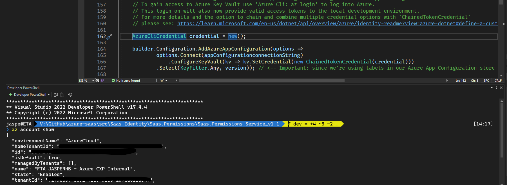
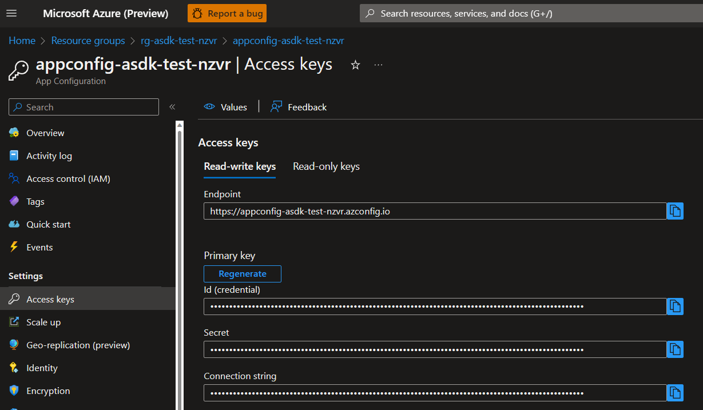
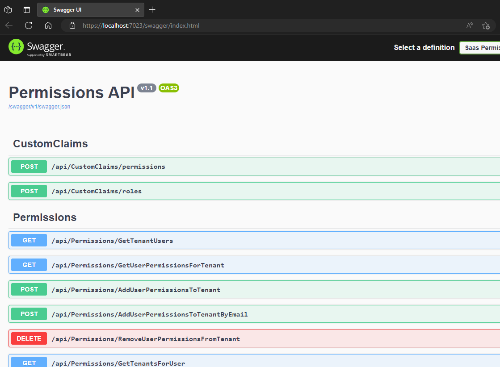
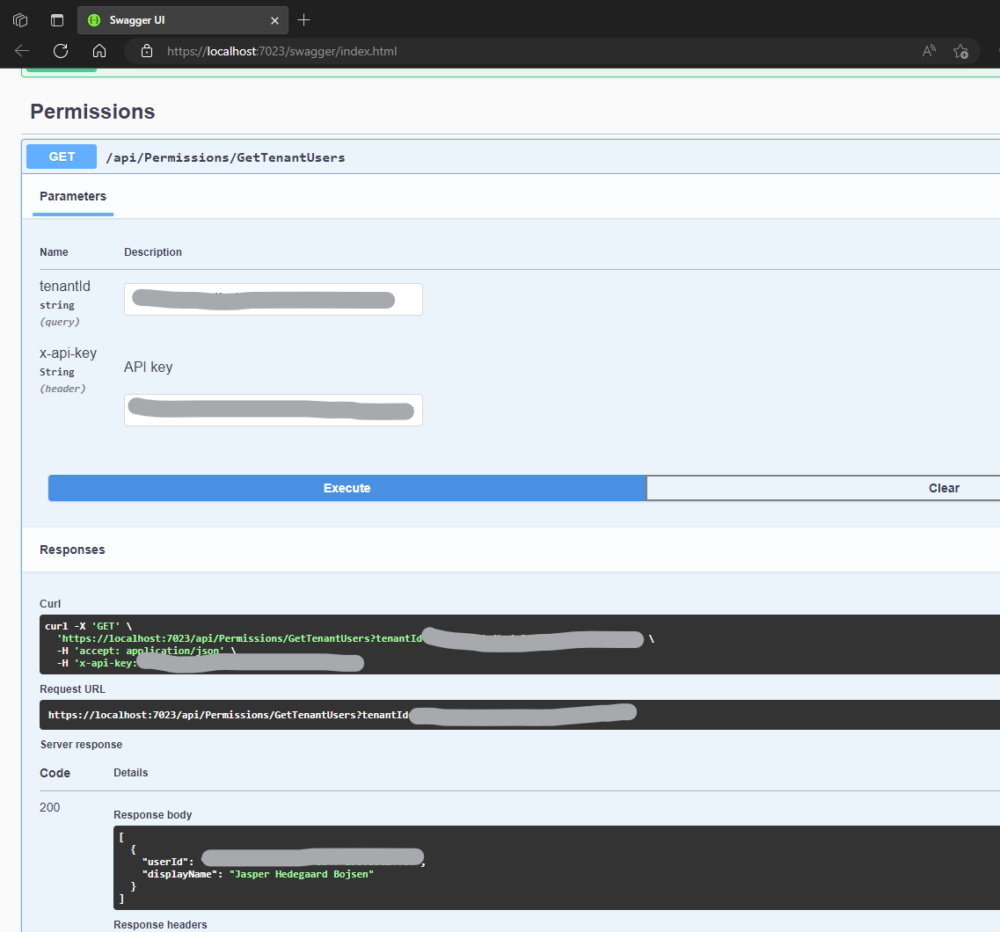
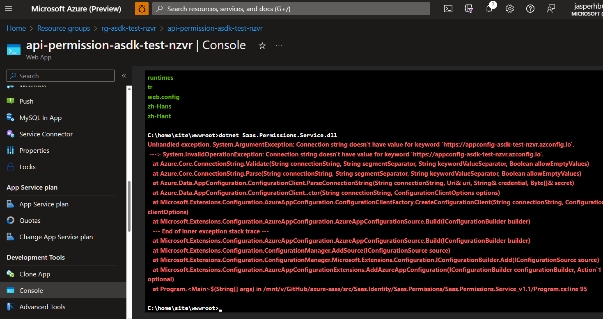

# SaaS Permissions Service API

## Overview

Section contains the ASDK Permissions Service API for handling role-based authorization of user. The service [depends](https://azure.github.io/azure-saas/components/identity/permissions-service#dependencies) on the Identity Foundation that was deployed a spart of the Identity Foundation and on the [Microsoft Graph API](https://learn.microsoft.com/en-us/graph/use-the-api).

For a complete overview, please see the [SaaS Permissions Service](https://azure.github.io/azure-saas/components/identity/permissions-service/) page in the documentation site.

## How to Run Locally

Once deployed, this service is a web API exposing endpoints to perform CRUD operations on user permission settings.

The SaaS Permissions Service API can be run locally during development, testing and learning.

### Requirements

To run the API locally, you must have the following installed on your developer machine:

- [Visual Studio 2022](https://visualstudio.microsoft.com/downloads/) (recommended) or [Visual Studio Code](https://code.visualstudio.com/download).
- [.NET 7.0](https://dotnet.microsoft.com/en-us/download/dotnet/7.0)
- [ASP.NET Core 7.0](https://docs.microsoft.com/en-us/aspnet/core/introduction-to-aspnet-core?view=aspnetcore-7.0)

> Tip: .NET 7.0 and ASP.NET Core 7.0 can be installed as part of the latest version Microsoft Visual Studio 2022.

You will also need a deployed instance of the [Identity Framework](https://azure.github.io/azure-saas/quick-start/). For details visit the [Deploying the Identify Foundation Services readme](../Saas.Identity.Provider/readme.md).

###  App Configuration and Settings

To manage settings securely and efficiently, settings are being stored in [Azure App Configuration](https://learn.microsoft.com/en-us/azure/azure-app-configuration/overview), while secrets and certificates are being stored in [Azure Key Vault](https://learn.microsoft.com/en-us/azure/key-vault/general/overview). Furthermore, secrets are represented with a reference (an URI) in Azure App Configuration pointing to the actual secret, which is kept safely and securely in Azure Key Vault. 

All necessary settings, certificates and secrets needed for running the SaaS Permissions API, where automatically created and provisioned during the deployment of the Identity Framework. 

### Setting up the local development environment

For running the SaaS Permission API Service in a local development environment, we need a few extra steps to set up access to the provisioned Azure App Configuration and the Azure Key Vault service, for your local development environment. 

#### Access and Permissions to Azure Key Vault 



For accessing Azure Key Vault, we will rely on [Azure CLI](https://learn.microsoft.com/en-us/cli/azure/install-azure-cli) to provide the needed access token. For this to work, you should open a terminal from within Visual Studio (or Visual Studio Code) and run these commands:

```bash
az account show # use this to see if you're already logged into your Azure tanent, if not use the next command to login
az login
```

Code have been added to the [ASP.NET Core](https://learn.microsoft.com/en-us/aspnet/core/introduction-to-aspnet-core?view=aspnetcore-7.0) project leveraging the local Azure CLI environment. You'll find this code in in `Program.cs`:

```csharp
if (builder.Environment.IsDevelopment())
{
    ...
    AzureCliCredential credential = new();

    builder.Configuration.AddAzureAppConfiguration(options =>
            options.Connect(appConfigurationconnectionString)
                .ConfigureKeyVault(kv => kv.SetCredential(new ChainedTokenCredential(credential)))
            .Select(KeyFilter.Any, version));
    ...
}
```

#### Access and permissions to Azure App Configuration

To manage access to Azure App Configuration, securely, we need one more thing. 

From your local development environment, you can leverage the Dotnet [Secret Manager](https://learn.microsoft.com/en-us/aspnet/core/security/app-secrets?view=aspnetcore-7.0&tabs=windows), to securely store a `connection string` allowing the local app to access the provisioned Azure App Configuration instance. 

This is a two step process:

1. The Azure App Configuration `connection string` can either be found in the Azure Portal by navigating to your Azure App Configuration instance, that was deployed as part of the Identity Foundation. Or, it can be obtained using this az cli command: 

```bash
az appconfig credential list --name "<name of your azure app configuration> --query [0].connectionString"
```

In the Azure Portal you can find the connection string here:



2. To add the `connection string` to the Secret Manager, run these commands in a terminal in the root directory of the project:

```cmd
dotnet user-secrets init #initialized your Secret Manager for the project.
dotnet user-secrets set ConnectionStrings:AppConfig "<your_azure_app_config_connection_string>"
```

> Tip: For more details on connecting a local development environment to Azure App Configuration please see: [Connect to the App Configuration store](https://learn.microsoft.com/en-us/azure/azure-app-configuration/quickstart-aspnet-core-app?tabs=core6x#connect-to-the-app-configuration-store). 

### Accessing the Azure SQL Server data from your developer environment

The following is good to know, for ensuring that your development environment has access to the SQL Server Database, that was deployed as part of the Identity Foundation.

During the deployment of the Identity Foundation, the deployment script takes note of the public IP address of the developer machine running the deployment script. The script then adds this specific IP address to an *allowed firewall rule* for the Azure SQL Server. 

Adding your public IP address is essential for your local development environment to be able to run. By default the configuration of the SQL Server only allow network access from IP addresses of services running *inside* the Azure environment. This default network security setting is great for production, however since your local development environment is not very likely to be running from within the Azure environment, this firewall restriction gets in the way.

> Tip: You may want to work on you project from multiple locations and development environments, in which case you will need to make changes to the firewall rules of Azure SQL Server, allowing these additional public IPs to access the database.
>

To add additional public IP addresses to the Azure SQL Service firewall rule, please do the following:

1. You can identity the global IP address of the developer machine you are currently running from, by running this bash command on MacOS, Linux or on Windows 10/11 from within a [WSL](https://learn.microsoft.com/en-us/windows/wsl/install) terminal session:

```bash
dig +short myip.opendns.com @resolver1.opendns.com
```

2. Visit the Azure portal and add the global IP address of the computing you are running the Permission Service from. 


## Running the Permissions Service API, Locally


After all of the above have been set up, you're now ready to build and run the SaaS Permissions Services in your local development environment. As you press debug/run, a browser will open and load a Swagger Page:

> Tip: Swagger is only enabled when the API is running locally. You'll find the details in `program.cs`.



Now *try it out* by running `GET /api/Permissions/GetTenantUsers` API. The first time you execute the request, it will take about 20-40 seconds to complete the request. This is because the app will need to authenticate itself, including getting a signed assertion from the Key Vault in the Identity Foundation.


Enter the `tenantId` of your Azure B2C Tenant (i.e., the `tenant id` of the Azure B2C tenant that was deployed as part of the Identity Foundation). You'll find it in the `config.json` file at `.deployment.azureb2c.tenantId`.



> Tip: After the first run, the access token is cached for the duration of it's life time, so if you try and run the request for a second time, it will be much faster. 

## How  to Deploy to Azure

For deploying the SaaS Permissions Service API to Azure a [GitHub Action](https://github.com/features/actions) is provide as part of the repo. 

> Tip: Establishing a [CI/CD](CI/CD) pipeline from the onset provides automation which increases security and minimizes operations. We highly recommend using this or some other CI/CD tool. 


> Info: During the deployment of the Identity Foundation, an [OIDC Connection](https://learn.microsoft.com/en-us/azure/app-service/deploy-github-actions?tabs=openid) was established between your Azure resource group and your GitHub repo. This connection enables GitHub action to push updates directly to your Azure App Services. Leveraging [OIDC](https://docs.github.com/en/actions/deployment/security-hardening-your-deployments/about-security-hardening-with-openid-connect) is the recommended authentication method for automated deployment, offering hardened security without the need to managing and keeping safe secrets or passwords.

To deploy the solution to Azure 

## How to debug in Azure

We're going to deploy for Windows, rather than Linux, because the Windows remote debugging is the most seamless, and we're expecting that you'll want to remote debug into the Azure instance to explore and see how the app runs there. That said, nothing prevents you from deploying to Linux for production, since ASP.NET Core 7 runs equally well on Linux.

For more on remote debugging with Visual Studio 2022 see: [Remote Debug ASP.NET Core on Azure App Service - Visual Studio (Windows) | Microsoft Learn](https://learn.microsoft.com/en-us/visualstudio/debugger/remote-debugging-azure-app-service?view=vs-2022). 


## How to Debug in Azure

After deploying to Azure everything should work. But what if it doesn't? We could attach a debugger then. Sure, but what if the ASP.NET Core app isn't even starting? 

### My app won't start

Command line to the rescue. 



<TO DO>